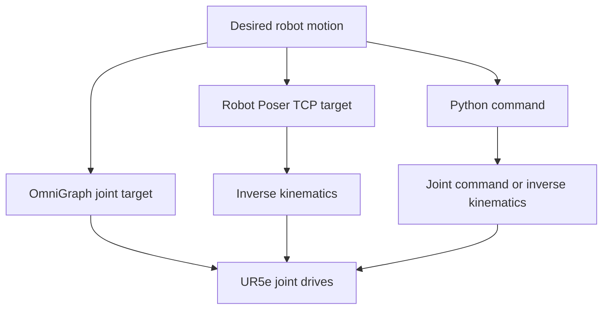

**Instructor:** Prof. [Sangram Redkar](mailto:Sangram.Redkar@asu.edu)

**Authors:**

- Sai Srinivas Tatwik Meesala: [smeesala@asu.edu](mailto:smeesala@asu.edu)
- Rajesh S Aouti: [raouti@asu.edu](mailto:raouti@asu.edu)
- Prajval Arora: [parora24@asu.edu](mailto:parora24@asu.edu)

---

> **Required scope:** Complete Parts A–G in order. Save the required USD checkpoints, capture the required screenshots, record the Part 1 GIF, test all five Python operations, and document the results in the formal report.

## Start Here

This laboratory has three learning phases:

1. **Joint control with OmniGraph:** Create the scene, import the UR5e, and command all six joints.
2. **TCP control with GUI inverse kinematics:** Register the flange as a Robot Site and move it with Robot Poser.
3. **Joint and TCP control with Python:** Load the provided `ur5e_control.py` module in Isaac Sim and execute its five operations.

Complete the parts in order. The later Python exercises depend on the robot and Robot Site configuration created earlier.

## Reference Documentation

- [Commonly Used OmniGraph Shortcuts](https://docs.isaacsim.omniverse.nvidia.com/6.0.1/omnigraph/omnigraph_shortcuts.html)
- [Robot Poser](https://docs.isaacsim.omniverse.nvidia.com/6.0.1/robot_setup/robot_poser.html)
- [Robot Schema and Site API](https://docs.isaacsim.omniverse.nvidia.com/6.0.1/omniverse_usd/robot_schema.html)
- [Articulation Controller](https://docs.isaacsim.omniverse.nvidia.com/6.0.1/robot_simulation/articulation_controller.html)

This laboratory is written for **Isaac Sim 6.0.1**. Menu names or asset locations may differ in another release.

## What You Will Do

You will:

1. Create a stage containing a ground plane and Physics Scene.
2. Add a UR5e robot under `/World`.
3. Inspect the robot articulation, links, and six actuated joints.
4. Generate an OmniGraph Joint Position Controller.
5. Send absolute joint-position targets in radians.
6. Register the UR5e flange as a Robot Site.
7. Create and move a TCP target with Robot Poser.
8. Load a reusable Python controller in the Isaac Sim Script Editor.
9. Command absolute joint angles in degrees.
10. Move the TCP to an absolute XYZ coordinate.
11. Move the TCP by delta X, Y, and Z.
12. Set the TCP orientation using roll, pitch, and yaw.
13. Read the current robot, joint, and TCP status.

## Learning Goals

By the end of this laboratory, you will be able to:

- Explain the difference between joint-space control and Cartesian TCP control.
- Identify the six UR5e revolute joints in their controller order.
- Use an OmniGraph articulation controller to command joint positions.
- Explain why OmniGraph joint angles are supplied in radians.
- Identify `base_link`, `wrist_3_link`, and `flange` in the UR5e hierarchy.
- Explain the purpose of a Robot Site.
- Use Robot Poser to solve inverse kinematics for a desired TCP pose.
- Distinguish a target TCP pose from the robot's actual flange pose.
- Import and reload a custom Python module in the Script Editor.
- Execute joint-space and TCP-space commands through Python.
- Interpret IK success and failure results.
- Prevent two controllers from commanding the same robot simultaneously.

## Control Concepts

The same UR5e is controlled in three different ways:



### Joint-space control

Joint-space control specifies a target angle for each joint. The controller does not directly specify where the flange should be located.

```text
Six desired joint angles
          ↓
Articulation controller
          ↓
Six UR5e joint drives
          ↓
Robot motion
```

### TCP control through inverse kinematics

TCP control specifies a desired position and/or orientation for the flange. An inverse-kinematics solver calculates a compatible set of joint angles.

```text
Desired TCP pose
      ↓
Inverse kinematics
      ↓
Six joint targets
      ↓
UR5e motion
```

> **Important:** Inverse kinematics finds a joint configuration for a target pose. It does not, by itself, guarantee a straight Cartesian path or collision-free motion.

## Required Software and Files

- Isaac Sim 6.0.1
- A working NVIDIA graphics driver and Isaac Sim installation
- Access to the Isaac Sim asset library
- The instructor-provided `ur5e_control.py` file
- A directory for the lab stage, code, screenshots, and GIF

Create the following structure before beginning:

```text
Lab2/
├── checkpoints/
├── code/
│   └── ur5e_control.py
└── screenshots/
```

The recommended Ubuntu project location is:

```text
/home/<username>/isaac_sim_projects/lab2/
```

Replace `<username>` with the user name of the computer being used.

## Units Used in This Laboratory

| Quantity | Interface | Unit |
|---|---|---|
| OmniGraph joint-position targets | `JointCommandArray` | radians |
| Python joint-position targets | `move_joints()` | degrees |
| TCP X, Y, and Z position | Robot Poser and Python | meters |
| TCP delta X, Y, and Z | `move_tcp_delta()` | meters |
| TCP roll, pitch, and yaw | `rotate_tcp()` | degrees |
| Reported joint velocity | `get_robot_status()` | radians per second |

> **Common error:** Do not enter degrees into `JointCommandArray`. For example, `0.20` radians is approximately `11.5°`.

## Laboratory Roadmap

| Phase | Part | Main task | Required result | Checkpoint |
|---|---|---|---|---|
| 1 | A | Create the stage and physics environment | Ground plane and Physics Scene exist | `Lab2_00_environment.usda` |
| 1 | B | Import and inspect the UR5e | Robot exists at `/World/ur5e` | `Lab2_01_ur5e_imported.usda` |
| 1 | C | Create OmniGraph joint control | Six joints respond to position targets | `Lab2_02_omnigraph_joint_control.usda` |
| 2 | D | Configure the flange as a Robot Site | `flange` is a recognized robot endpoint | `Lab2_03_robot_site.usda` |
| 2 | E | Use Robot Poser for TCP IK | Flange follows a named TCP target | `Lab2_04_robot_poser_ik.usda` |
| 3 | F | Prepare Python control | Module imports and controller initializes | `Lab2_05_python_ready.usda` |
| 3 | G | Execute the five Python operations | Joint, TCP, rotation, and status commands work | `Lab2_06_final.usda` |

# Phase 1: UR5e Joint Control with OmniGraph

# Part A: Create the Stage and Physics Environment

## A1. Launch Isaac Sim

Launch Isaac Sim and wait until the interface is completely loaded. Do not create or import objects while the application is still initializing.

Identify the following interface areas:

| Interface area | Purpose in this lab |
|---|---|
| Viewport | Observe the UR5e and manipulate the TCP target |
| Stage panel | Inspect the robot, links, sites, named poses, and graph |
| Property panel | Edit transforms, graph commands, and Robot Schema properties |
| Timeline | Start and stop physics simulation |
| Action Graph editor | Inspect the generated OmniGraph controller |
| Script Editor | Run the Python controller module |

## A2. Create and save a new stage

1. Select **File → New Stage**.
2. If prompted to save an existing stage, save it or discard it as directed by the instructor.
3. Select **File → Save As**.
4. Save the new stage as:

   ```text
   Lab2/checkpoints/Lab2_00_environment.usda
   ```

## A3. Add the ground plane

1. Select **Create → Physics → Ground Plane**.
2. Confirm that a ground-plane prim appears under `/World`.
3. Select the ground plane and verify that it is approximately at the world origin:

   ```text
   Translate X = 0.0 m
   Translate Y = 0.0 m
   Translate Z = 0.0 m
   ```

## A4. Verify or add the Physics Scene

Adding a ground plane may automatically create a Physics Scene. Inspect the Stage panel.

- If `/World/PhysicsScene` exists, do not create a duplicate.
- If it does not exist, select **Create → Physics → Physics Scene**.

The Physics Scene provides gravity and simulation settings for the stage.

## A5. Save and capture evidence

Save the stage. Capture:

```text
screenshots/01_environment.png
```

The screenshot must show the ground plane and Physics Scene in the Stage panel.

### Validation checkpoint A

- [ ] The stage is saved.
- [ ] A ground plane exists near the world origin.
- [ ] Exactly one Physics Scene exists.
- [ ] The environment screenshot was captured.

# Part B: Import and Inspect the UR5e

## B1. Locate the robot asset

1. Open the Isaac Sim Asset Browser or Content Browser.
2. Search for:

   ```text
   ur5e.usd
   ```

3. Select the Universal Robots UR5e asset.
4. Drag the asset into the viewport or under `/World` in the Stage panel.

Asset folder organization can vary slightly between Isaac Sim installations. Use the search field if the robot is not visible in the expected Universal Robots folder.


## B2. Verify the robot prim path

The robot must be located at:

```text
/World/ur5e
```

If the imported prim has another name, rename only the root prim to `ur5e`. Do not rename its internal links or joints.

## B3. Verify the robot transform

Select `/World/ur5e` and place the robot at the world origin unless the instructor specifies another location:

```text
Translate X = 0.0 m
Translate Y = 0.0 m
Translate Z = 0.0 m
```

Confirm visually that the robot base is on the ground plane and not below it.

## B4. Inspect the UR5e hierarchy

Expand `/World/ur5e` in the Stage panel. Locate at least the following items:

```text
/World/ur5e/base_link
/World/ur5e/wrist_3_link
/World/ur5e/wrist_3_link/flange
```

The important distinction is:

| Prim | Meaning |
|---|---|
| `base_link` | Base of the kinematic chain used in this lab |
| `wrist_3_link` | Final physical wrist link |
| `flange` | Tool attachment frame used as the TCP |
| `Gripper` | Optional gripper container; it is not the TCP for this lab |

## B5. Identify the six controlled joints

The UR5e controller uses the following order:

| Index | Joint name |
|---:|---|
| 0 | `shoulder_pan_joint` |
| 1 | `shoulder_lift_joint` |
| 2 | `elbow_joint` |
| 3 | `wrist_1_joint` |
| 4 | `wrist_2_joint` |
| 5 | `wrist_3_joint` |


This order is important whenever six command values are supplied as one array.

## B6. Save and capture evidence

Save As:

```text
Lab2/checkpoints/Lab2_01_ur5e_imported.usda
```

Capture:

```text
screenshots/02_ur5e_hierarchy.png
```

The screenshot must show the complete robot and the expanded UR5e hierarchy.

### Validation checkpoint B

- [ ] The UR5e is visible in the viewport.
- [ ] The robot root path is `/World/ur5e`.
- [ ] The base is positioned on the ground plane.
- [ ] `base_link`, `wrist_3_link`, and `flange` were located.
- [ ] The six controlled joints and their order were recorded.

# Part C: Control the UR5e Joints with OmniGraph

## C1. Stop the simulation before creating the graph

Press **Stop** on the timeline. Creating the graph while the simulation is stopped makes the setup easier to inspect and prevents unexpected commands.

## C2. Generate the Joint Position Controller

1. Select **Tools → Robotics → OmniGraph Controllers → Joint Position Controller**.
2. In the controller setup window, set **Robot Prim** to:

   ```text
   /World/ur5e
   ```


3. Keep the proposed graph path unless instructed otherwise.
4. Leave **Add to Existing Graph** cleared for this first graph.
5. Create the graph.

> **Important:** The shortcut does not check whether another graph already controls the same robot. Create only one joint-position graph for the UR5e.

## C3. Inspect the generated graph

Open **Window → Graph Editors → Action Graph** if the graph is not already displayed.


The generated graph should contain nodes with the following roles:

| Node | Purpose |
|---|---|
| Playback/tick node | Executes the graph repeatedly while the timeline is playing |
| `JointNameArray` | Defines which robot joints receive commands and their order |
| `JointCommandArray` | Stores the desired joint-position values |
| `ArticulationController` | Sends the commands to the UR5e articulation drives |

The command flow is:

```text
Playback tick
      ↓
Joint names + joint position commands
      ↓
Articulation Controller
      ↓
UR5e joint drives
```

## C4. Verify the joint-name order

1. Select the `JointNameArray` node.
2. In the Property panel, confirm that it contains the six UR5e joints in this order:

   ```text
   shoulder_pan_joint
   shoulder_lift_joint
   elbow_joint
   wrist_1_joint
   wrist_2_joint
   wrist_3_joint
   ```


3. Do not reorder the names unless the command array is reordered in exactly the same way.

## C5. Enter a safe joint-position command

1. Select the `JointCommandArray` node.
2. Enter the following six position targets:

   ```text
   [0.20, -0.40, 0.40, -0.30, 0.20, 0.10]
   ```

3. Confirm that the array contains exactly six values.

These are **absolute joint targets in radians**. They do not mean “move each joint by this amount.” For example, the first value requests that `shoulder_pan_joint` move toward `0.20` radians.

## C6. Run the graph

1. Press **Play**.
2. Observe the UR5e moving toward the commanded configuration.
3. Change only the first value from `0.20` to `0.10`.
4. Observe that the shoulder-pan joint responds while the other target values remain unchanged.
5. Restore the first value to `0.20` if required.
6. Press **Stop** after the observations are complete.

Expected result:

- The robot moves only when the timeline is playing.
- The six values map to the six joints in the same order as `JointNameArray`.
- The robot moves toward absolute targets rather than adding an increment to its current angles.


## C7. Save, capture, and record the GIF

Save As:

```text
Lab2/checkpoints/Lab2_02_omnigraph_joint_control.usda
```

Capture:

```text
screenshots/03_omnigraph_controller.png
```

The screenshot must show the generated graph, including the joint-name, joint-command, and articulation-controller nodes.

Record or insert the instructor-provided GIF at:

```text
gifs/lab2_part1_omnigraph_joint_control.gif
```

The GIF should show:

1. Opening the Joint Position Controller shortcut.
2. Selecting `/World/ur5e`.
3. Creating the graph.
4. Editing `JointCommandArray`.
5. Pressing Play and observing the robot motion.

### Validation checkpoint C

- [ ] One Joint Position Controller graph exists.
- [ ] The robot path is `/World/ur5e`.
- [ ] The graph lists the correct six joints.
- [ ] The command array contains six values in radians.
- [ ] The UR5e moves to the requested joint configuration.
- [ ] The graph screenshot and Part 1 GIF are available.

# Phase 2: TCP Control with GUI Inverse Kinematics

# Part D: Configure the Flange as a Robot Site

## D1. Understand why the Robot Site is required

The prim `/World/ur5e/wrist_3_link/flange` is an `Xform` representing the tool attachment frame. Robot Poser must recognize it as part of the robot's kinematic description before it can use the flange as an IK endpoint.

Applying the **Site API** identifies the flange as a point of interest on the robot. Adding it to the robot's links relationship associates that site with the UR5e.

| Operation | Is the flange Robot Site required? |
|---|---:|
| OmniGraph joint-angle control | No |
| Python joint-angle control | No |
| GUI TCP control using `flange` | Yes |
| Python TCP control using `flange` | Yes |

## D2. Apply Site API to the flange

1. Press **Stop**.
2. Expand:

   ```text
   /World/ur5e/wrist_3_link
   ```

3. Select:

   ```text
   /World/ur5e/wrist_3_link/flange
   ```

4. In the Property panel, click **Add**.
5. Select **Isaac → Robot Schema → Site API**.
6. Confirm that a Robot Site or Site API section appears in the flange properties.


## D3. Add the flange to the UR5e robot links

1. Select the robot root:

   ```text
   /World/ur5e
   ```

2. Locate the Robot Schema or Robot API properties.
3. Find the **Robot Links** relationship.


4. Choose **Add Link**.
5. Select the `flange` prim at:

   ```text
   /World/ur5e/wrist_3_link/flange
   ```


6. Confirm that `flange` appears in the Robot Links list.


Do not add the optional `/World/ur5e/Gripper` container as the TCP for this lab.

## D4. Save and capture evidence

Save As:

```text
Lab2/checkpoints/Lab2_03_robot_site.usda
```

Capture:

```text
screenshots/04_flange_robot_site.png
```

The screenshot must show `flange` selected and the Site API section visible.

### Validation checkpoint D

- [ ] Site API is applied to `flange`.
- [ ] `flange` is included in the UR5e Robot Links relationship.
- [ ] The site configuration is saved in the USD stage.
- [ ] The Robot Site screenshot was captured.

# Part E: Move the TCP with Robot Poser

## E1. Open Robot Poser

1. Select **Tools → Robotics → Robot Poser**.


2. In **Active Robot**, select:

   ```text
   /World/ur5e
   ```

3. If the UR5e does not appear in the list, confirm that the robot root has Robot API and that the correct stage is open.


## E2. Define the IK chain

Set:

```text
Start Site: base_link
End Site: flange
```

If more than one `base_link` appears, hover over or inspect the path and select the one under `/World/ur5e`.

The selected chain begins at the robot base and ends at the flange TCP.

## E3. Create a named TCP pose

1. Click **Add** in Robot Poser.
2. A new named-pose row appears.
3. Rename the pose:

   ```text
   TCP
   ```

4. Confirm that the pose uses `base_link` as the start and `flange` as the end.

The target is normally stored beneath a named-pose scope under the robot. Its exact display path may resemble:

```text
/World/ur5e/Named_Poses/TCP
```

## E4. Enable target tracking

1. Click **Track Target** for the `TCP` pose.
2. Select the `TCP` named-pose prim in the Stage panel or viewport.


3. Use the move gizmo or the Transform properties to change the target position.
4. Make small changes first, such as `0.01 m` or `0.02 m` along one axis.
5. Observe the robot updating as inverse kinematics solves for new joint angles.

When the timeline is stopped, applying a pose updates the robot configuration directly. When the timeline is playing, the pose is applied through the robot's joint targets and the simulated drives move the robot toward the solution. Use the playing simulation when demonstrating physical motion.

A sample reachable target used during development was:

```text
X = 0.50 m
Y = 0.50 m
Z = 0.20 m
```

Reachability also depends on the target orientation and the robot's current configuration. If the sample is not reachable from the current pose, return to the last valid target and move in smaller increments.


## E5. Change the target orientation

Use the rotate gizmo or orientation fields to make a small rotation. Robot Poser treats both translation and orientation as parts of the desired TCP pose.

Observe the distinction:

```text
Named TCP target = desired pose
Flange          = actual robot endpoint
Robot Poser     = IK solver connecting the two
```

## E6. Recognize IK failure

Move the target far outside the UR5e workspace. When the solver cannot find a valid solution, the robot chain may be outlined in red and the robot will not reach the target.

Return the target to the last reachable location and confirm that normal tracking resumes.

## E7. Stop target tracking

Click **Track Target** again so tracking is **off**.

This step is mandatory before Python control. If tracking remains active, Robot Poser can continue writing joint targets every frame and interfere with Python commands.

## E8. Save and capture evidence

Save As:

```text
Lab2/checkpoints/Lab2_04_robot_poser_ik.usda
```

Capture:

```text
screenshots/05_robot_poser_tcp.png
```

The screenshot must show Robot Poser, the `TCP` pose, `base_link`, `flange`, and the robot at a valid IK pose.

### Validation checkpoint E

- [ ] Robot Poser recognizes `/World/ur5e`.
- [ ] The chain starts at `base_link` and ends at `flange`.
- [ ] A named pose called `TCP` exists.
- [ ] The flange follows the reachable target.
- [ ] An unreachable-target condition was observed and corrected.
- [ ] Track Target is off before continuing.

# Phase 3: Joint and TCP Control with Python

# Part F: Prepare the Stage and Python Module

## F1. Create a controller-safe stage copy

The OmniGraph controller from Part C and Robot Poser tracking can both issue joint targets. Python must be the only active controller during Part G.

1. Confirm that **Track Target is off** for every named pose.
2. Select **File → Save As**.
3. Save a Python-control copy as:

   ```text
   Lab2/checkpoints/Lab2_05_python_ready.usda
   ```

4. In this new copy only, disable the Joint Position Controller graph. If a clear graph-enable control is not available, delete the generated graph prim from this copy.
5. Do not delete the graph from `Lab2_02_omnigraph_joint_control.usda`; that checkpoint preserves the Part C work.

Before continuing, verify:

- Robot Poser Track Target is off.
- The OmniGraph joint controller is disabled or absent in the Python-stage copy.
- The flange Site API remains configured.

## F2. Place `ur5e_control.py`

Create this directory using the Ubuntu file manager:

```text
/home/<username>/isaac_sim_projects/lab2/
```

Copy the instructor-provided file into that directory:

```text
/home/<username>/isaac_sim_projects/lab2/ur5e_control.py
```

Do not rename the file. Confirm that the extension is `.py`, not `.py.txt`.

The file is designed to run **inside Isaac Sim only**. This laboratory does not use a terminal command-line interface or a separate standalone Isaac Sim process.

## F3. Open the Script Editor

1. Open the stage `Lab2_05_python_ready.usda`.
2. Select **Window → Script Editor**.
3. Press **Play** so the articulation and physics simulation are initialized.
4. Keep Robot Poser Track Target off.

## F4. Import the module and create the controller

Paste the following into the Script Editor. Update the path if the file was placed elsewhere.

```python
import os
import sys
import importlib

module_directory = os.path.expanduser(
    "~/isaac_sim_projects/lab2"
)

if module_directory not in sys.path:
    sys.path.append(module_directory)

import ur5e_control
importlib.reload(ur5e_control)

robot = ur5e_control.UR5eController()

print("UR5e controller ready")
```

### BEFORE RUNNING MAKE SURE YOU Click Play in Isaac Sim. Wait about one second AND Keep the simulation playing.

Click **Run**.

Expected output:

```text
UR5e controller ready
```


No robot motion is expected during initialization.

### Why `importlib.reload()` is used

Isaac Sim keeps imported modules in memory. If `ur5e_control.py` is edited and imported again, Python may continue using the earlier in-memory version. `importlib.reload()` loads the current file contents.

### When the controller must be recreated

Run the initialization block again after any of the following:

- Opening another stage.
- Pressing Stop and restarting the simulation.
- Reloading or modifying `ur5e_control.py`.
- Deleting and re-importing the UR5e.

### Validation checkpoint F

- [ ] The Python-stage copy is open.
- [ ] Track Target is off.
- [ ] The OmniGraph joint controller is disabled or absent.
- [ ] The timeline is playing.
- [ ] `ur5e_control.py` imports successfully.
- [ ] `robot = ur5e_control.UR5eController()` completes without an error.

# Part G: Execute the Five Python Operations

The module exposes exactly five student-facing operations:

| No. | Function | Purpose |
|---:|---|---|
| 1 | `move_joints()` | Move to absolute joint angles |
| 2 | `move_tcp_to()` | Move the TCP to an absolute XYZ point |
| 3 | `move_tcp_delta()` | Move the TCP by delta X, Y, and Z |
| 4 | `rotate_tcp()` | Set the absolute TCP roll, pitch, and yaw |
| 5 | `get_robot_status()` | Read the current joint and TCP state |

Keep the timeline playing while executing the motion commands.

## G1. Operation 1 — Move by joint angles

Run:

```python
from pprint import pprint

result = robot.move_joints(
    [0, -30, 30, -20, 10, 0]
)

pprint(result)
```

The six values are absolute angles in **degrees** and use this order:

```text
0 → shoulder_pan_joint
1 → shoulder_lift_joint
2 → elbow_joint
3 → wrist_1_joint
4 → wrist_2_joint
5 → wrist_3_joint
```


Expected result:

- The robot moves to the requested joint configuration.
- The returned dictionary reports `"applied": True`.
- The returned `joint_order` confirms how the six values were mapped.
- `target_angles_degrees` reports the applied targets.

The command is absolute. Repeating the same command does not add another `[0, -30, 30, -20, 10, 0]` degrees.

### Move selected joints only

The same operation also accepts joint names:

```python
result = robot.move_joints({
    "shoulder_pan_joint": 15,
    "elbow_joint": 30,
})

pprint(result)
```

Only the listed targets are changed. The omitted joints retain their current positions as their new targets.

Capture:

```text
screenshots/06_python_joint_control.png
```

## G2. Operation 2 — Move the TCP to an absolute XYZ point

Run:

```python
result = robot.move_tcp_to(
    x=0.50,
    y=0.45,
    z=0.25,
)

pprint(result)
```


Interpretation:

- `x`, `y`, and `z` are absolute TCP coordinates in meters.
- The coordinates are expressed in the robot coordinate frame used by the controller.
- The current TCP orientation is preserved.
- Robot Poser solves IK and applies the resulting joint targets.

Expected result when the pose is reachable:

```text
'success': True
'target_position_m': [0.5, 0.45, 0.25]
```

If `success` is `False`, the function does not apply the failed solution. Choose a closer point or return to the last reachable pose.

> **Important:** This command requests a final TCP pose. It does not guarantee that the flange follows a straight line from its initial pose to the target.

## G3. Operation 3 — Move the TCP by delta X, Y, and Z

Move the TCP by `0.02 m` in positive X:

```python
result = robot.move_tcp_delta(
    delta_x=0.02,
)

pprint(result)
```

Move along three axes in one command:

```python
result = robot.move_tcp_delta(
    delta_x=0.02,
    delta_y=-0.01,
    delta_z=0.03,
)

pprint(result)
```

Interpretation:

- `delta_x=0.02` means `+2 cm` along robot X.
- `delta_y=-0.01` means `-1 cm` along robot Y.
- `delta_z=0.03` means `+3 cm` along robot Z.
- Any omitted delta defaults to zero.
- The current TCP orientation is preserved.

The result reports:

- Whether IK succeeded.
- The requested delta in meters.
- The calculated absolute target position.

Do not repeatedly run a delta command without observing the robot. Every successful run starts from the current TCP position, so repeated calls accumulate motion.

Capture:

```text
screenshots/07_python_tcp_translation.png
```

## G4. Operation 4 — Rotate the TCP

Run:

```python
result = robot.rotate_tcp(
    roll_x=180,
    pitch_y=0,
    yaw_z=90,
)

pprint(result)
```

Interpretation:

| Argument | Meaning |
|---|---|
| `roll_x` | Rotation about X in degrees |
| `pitch_y` | Rotation about Y in degrees |
| `yaw_z` | Rotation about Z in degrees |

This operation:

- Preserves the current TCP X, Y, and Z position.
- Sets an **absolute** Euler orientation.
- Uses IK to calculate the joint angles required to produce that orientation.
- Does not expose quaternions to the student-facing interface.

Expected result for a reachable orientation:

```text
'success': True
'target_rotation_degrees': [180, 0, 90]
```

The robot joints must move even though only TCP rotation is requested. The flange orientation can change only through joint motion.

If the result is unsuccessful, return to a reachable TCP point and request a smaller orientation change.

Capture:

```text
screenshots/08_python_tcp_rotation.png
```

## G5. Operation 5 — Get the current robot status

Run:

```python
status = robot.get_robot_status()
pprint(status)
```

The returned status contains:

| Field | Meaning |
|---|---|
| `robot_path` | UR5e root prim path |
| `base_path` | IK start-link path |
| `tcp_path` | IK endpoint/TCP path |
| `timeline_playing` | Whether Isaac Sim is currently playing |
| `joint_names` | Six controlled joints in controller order |
| `joint_positions_degrees` | Current joint angles in degrees |
| `joint_velocities_radians_per_second` | Current joint velocities |
| `tcp_position_m` | Current TCP X, Y, and Z in meters |
| `tcp_rotation_degrees` | Current TCP roll, pitch, and yaw in degrees |

Wait for the robot to settle and run the status command again. The joint velocities should approach zero after the final pose is reached.

Capture:

```text
screenshots/09_python_robot_status.png
```

The screenshot must show the Script Editor output containing joint positions and the TCP pose.

## G6. Compare the three control methods

| Method | Student specifies | Internal result | Units entered |
|---|---|---|---|
| OmniGraph joint control | Six joint targets | Joint-drive targets | radians |
| Robot Poser GUI | Desired target pose | IK-generated joint targets | meters and GUI orientation values |
| Python `move_joints()` | Six angles or selected named joints | Joint-drive targets | degrees |
| Python TCP functions | Desired TCP position or orientation | IK-generated joint targets | meters and degrees |

### Validation checkpoint G

- [ ] `move_joints()` moved all six joints using an ordered list.
- [ ] `move_joints()` moved selected joints using their names.
- [ ] `move_tcp_to()` reached a valid absolute XYZ target.
- [ ] `move_tcp_delta()` produced the expected incremental translation.
- [ ] `rotate_tcp()` changed orientation while preserving position.
- [ ] `get_robot_status()` reported the current joint and TCP state.
- [ ] Each IK command returned `success: True` for the submitted run.
- [ ] The required Python screenshots were captured.

Save the final stage as:

```text
Lab2/checkpoints/Lab2_06_final.usda
```

# Troubleshooting

## The UR5e asset cannot be found

- Confirm that the asset library is connected.
- Search for `ur5e.usd` rather than navigating manually through folders.
- Confirm that the correct Isaac Sim version is running.

## The OmniGraph controller does not move the robot

- Confirm that the timeline is playing.
- Confirm that the controller's robot prim is `/World/ur5e`.
- Confirm that `JointCommandArray` contains exactly six values.
- Confirm that the values are in radians.
- Confirm that another graph was not created for the same robot.

## The wrong joint moves

- Compare `JointNameArray` with `JointCommandArray`.
- Verify that both arrays contain six entries in the same order.
- Remember that array indices begin at zero.

## `flange` is not available in Robot Poser

- Confirm that Site API was applied to `/World/ur5e/wrist_3_link/flange`.
- Confirm that `flange` was added to the UR5e Robot Links relationship.
- Save the stage and reopen Robot Poser.

## Robot Poser shows a red outline

- The requested target is unreachable or the IK solver failed to converge.
- Move the target closer to the previous valid pose.
- Change one position or orientation component at a time.
- Confirm that the chain is `base_link` to `flange`.

## Python reports `ModuleNotFoundError: ur5e_control`

- Confirm that `ur5e_control.py` is in the directory added to `sys.path`.
- Confirm that the file is not named `ur5e_control.py.txt`.
- Check the spelling and capitalization of the directory and filename.
- Run the complete initialization block again.

## Python reports that the robot, base, or TCP cannot be found

Verify these exact paths in the Stage panel:

```text
/World/ur5e
/World/ur5e/base_link
/World/ur5e/wrist_3_link/flange
```

If the root robot prim has a different name, rename it to `ur5e` or update the controller file as directed by the instructor.

## Python reports that the Robot Schema is invalid

- Confirm that the official Isaac Sim UR5e asset was imported.
- Confirm that Robot API exists on `/World/ur5e`.
- Confirm that the stage containing the Robot Site configuration is open.

## A Python motion returns `success: False`

- The requested TCP pose is not currently reachable.
- Move the target closer to the current TCP pose.
- Reduce the requested change.
- Test position and orientation separately.
- Confirm that the flange Robot Site is correctly configured.

## The robot moves back or appears to fight the Python command

Another controller is still active.

1. Turn off Robot Poser **Track Target**.
2. Disable or remove the OmniGraph joint controller from the Python-stage copy.
3. Recreate the Python controller object.
4. Reissue the command.

## Python worked before Stop but now produces an error

Press **Play**, then rerun:

```python
importlib.reload(ur5e_control)
robot = ur5e_control.UR5eController()
```

The articulation wrapper should be recreated after a timeline or stage reset.

# Required Deliverables

Submit the following checkpoint stages:

```text
Lab2_00_environment.usda
Lab2_01_ur5e_imported.usda
Lab2_02_omnigraph_joint_control.usda
Lab2_03_robot_site.usda
Lab2_04_robot_poser_ik.usda
Lab2_05_python_ready.usda
Lab2_06_final.usda
```

Submit the Python file:

```text
ur5e_control.py
```

Submit these screenshots:

```text
01_environment.png
02_ur5e_hierarchy.png
03_omnigraph_controller.png
04_flange_robot_site.png
05_robot_poser_tcp.png
06_python_joint_control.png
07_python_tcp_translation.png
08_python_tcp_rotation.png
09_python_robot_status.png
```

Submit the Part 1 GIF:

```text
lab2_part1_omnigraph_joint_control.gif
```

Submit a short demonstration video showing:

1. OmniGraph joint control.
2. GUI TCP control with Robot Poser.
3. Track Target being turned off.
4. Python joint control.
5. Python absolute and delta TCP translation.
6. Python TCP rotation.
7. The final robot status output.

## Report Expectations

Submit one comprehensive formal lab report using the [RAS 545 Lab Report Template](https://docs.google.com/document/d/1HOYJqnCjeE1o-8Ghffh58nG2FxjORW-J/edit?usp=sharing&ouid=109541660202730576301&rtpof=true&sd=true).

The report must contain:

1. Title page.
2. Lab objectives and learning goals.
3. Software and hardware configuration.
4. Procedure for Parts A–G.
5. Results and validation evidence.
6. Observations and troubleshooting.
7. Required screenshots and GIF.
8. Explanation of joint-space control.
9. Explanation of TCP control and inverse kinematics.
10. Explanation of why the flange requires Site API.
11. Comparison of OmniGraph, GUI Robot Poser, and Python control.
12. Explanation of absolute versus delta commands.
13. Explanation of why Track Target and the OmniGraph controller must not remain active during Python control.
14. Key learnings.
15. Conclusion.
16. References.

For each part, record:

- The procedure followed.
- The corresponding checkpoint filename.
- The screenshot filename.
- The command or target values used.
- The observed robot response.
- Whether IK succeeded.
- Any error and its correction.
- One key learning.

# Lab Check-Off

Notify the teaching staff after the final stage, screenshots, GIF, report, and demonstration video are ready.

The check-off must confirm:

1. The stage contains a ground plane and Physics Scene.
2. The UR5e exists at `/World/ur5e`.
3. The OmniGraph controller moves the six UR5e joints.
4. `flange` has Site API and is included in Robot Links.
5. Robot Poser moves the flange through a named TCP target.
6. Track Target is off before Python commands are used.
7. No OmniGraph controller competes with Python control.
8. All five Python operations execute successfully.
9. The student can explain the units used by each interface.
10. The student can explain why IK success does not imply collision-free or straight-line motion.

# Final Validation

- [ ] The Lab 2 directory structure was created.
- [ ] The stage contains one ground plane and one Physics Scene.
- [ ] The UR5e root path is `/World/ur5e`.
- [ ] The six UR5e joint names and their order were verified.
- [ ] The OmniGraph Joint Position Controller was created.
- [ ] Joint commands were entered in radians.
- [ ] The robot responded correctly to the OmniGraph commands.
- [ ] Site API was applied to `flange`.
- [ ] `flange` was added to the Robot Links relationship.
- [ ] A named `TCP` pose was created in Robot Poser.
- [ ] A reachable TCP target was achieved.
- [ ] An unreachable-target condition was recognized.
- [ ] Track Target was turned off.
- [ ] The OmniGraph controller was disabled or removed from the Python-stage copy.
- [ ] `ur5e_control.py` was placed in the project directory.
- [ ] The Python controller initialized while the timeline was playing.
- [ ] `move_joints()` was tested.
- [ ] `move_tcp_to()` was tested.
- [ ] `move_tcp_delta()` was tested.
- [ ] `rotate_tcp()` was tested.
- [ ] `get_robot_status()` was tested.
- [ ] Each submitted IK command returned success.
- [ ] All checkpoint stages were saved.
- [ ] All required screenshots were captured.
- [ ] The Part 1 GIF was included.
- [ ] The formal report was completed.
- [ ] The demonstration video was recorded.
- [ ] Teaching staff were notified for check-off.

## Completion Requirement

The laboratory is complete when the student can demonstrate all three control workflows and explain their differences:

```text
OmniGraph joint targets
Robot Poser GUI TCP target with IK
Python joint and TCP commands
```

The student must also demonstrate that only one controller is actively commanding the UR5e at a time.
