<script src="https://cdn.jsdelivr.net/npm/mermaid@10/dist/mermaid.min.js"></script>
<script>
document.addEventListener("DOMContentLoaded", function () {
  mermaid.initialize({ startOnLoad: false, theme: "default" });
  document.querySelectorAll("pre > code.language-mermaid").forEach(function (code) {
    var pre = code.parentElement;
    var div = document.createElement("div");
    div.className = "mermaid";
    div.textContent = code.textContent;
    pre.replaceWith(div);
  });
  mermaid.run();
});
</script>
<style>
@media print {
  .mermaid,
  pre,
  table,
  blockquote {
    break-inside: avoid;
    page-break-inside: avoid;
  }
}
</style>

**Instructor:** Prof. [Sangram Redkar](mailto:Sangram.Redkar@asu.edu)

**Authors:**

- Sai Srinivas Tatwik Meesala: [smeesala@asu.edu](mailto:smeesala@asu.edu)
- Rajesh S Aouti: [raouti@asu.edu](mailto:raouti@asu.edu)

---

## 1. Lab Overview

This laboratory transforms a prepared TurtleBot 3 simulation model into a ROS2-enabled mobile robot. You will progressively add and validate the core capabilities needed for autonomous operation in simulation.

### At a glance

By the end of this lab, you will build a complete ROS2 mobile robot in Isaac Sim and verify that it can:

- publish simulation time on `/clock`
- receive velocity commands on `/cmd_vel`
- drive using differential-wheel control
- publish LIDAR data on `/scan`
- publish camera data on `/camera/image_raw`
- publish odometry and TF transforms
- localize the robot using AMCL and a saved map
- navigate to a goal using Nav2

The system is assembled incrementally, and each section ends with a validation checkpoint to confirm that the current stage is functioning correctly.

### Learning outcomes

After completing this laboratory, you will be able to:

- configure and validate real-time ROS2 communication in Isaac Sim
- build a differential-drive mobile robot controller
- publish sensor data from a simulated LIDAR and camera
- publish odometry and TF information for robot localization
- configure AMCL and Nav2 for map-based navigation

> Important: This lab is intentionally structured as a layered robotics integration exercise. Complete each section in order, and do not proceed until the current checkpoint is working.

> Critical constraint: The TF tree must not contain both `world -> odom` and `map -> odom`. Use only the valid transform chain required by this lab.

The required system architecture is:

```text
Isaac Sim
│
├── Physics simulation
├── TurtleBot articulation
├── Camera sensor
├── RTX lidar sensor
├── ROS2 Action Graphs
│
└── ROS2
    ├── /clock
    ├── /cmd_vel
    ├── /odom
    ├── /tf
    ├── /scan
    ├── /camera/image_raw
    └── /map

Nav2
├── Map server
├── AMCL
├── Global costmap
├── Local costmap
├── Planner
└── Controller
```

The final TF tree must be:

```text
map
└── odom
    └── base_footprint
        ├── base_link
        ├── base_scan
        ├── wheel_left_link
        ├── wheel_right_link
        ├── caster_back_link
        └── Camera_1
```

Do not create or publish:

```text
world → odom
```

For this laboratory, AMCL publishes:

```text
map → odom
```

Isaac Sim publishes:

```text
odom → base_footprint
base_footprint → robot links
```

A frame must not have two competing parents.

---

## 2. What You Will Do

You will begin with the supplied TurtleBot USD file. The supplied file contains:

- A TurtleBot 3 Burger model
- Robot visual geometry
- Robot collision geometry
- Rigid-body physics
- Articulation and joints
- A ground plane
- Lighting
- A world observation camera

The supplied file intentionally does not contain:

- ROS2 Action Graphs
- A ROS2 clock publisher
- A velocity command subscriber
- A lidar sensor
- A camera mounted on the robot
- A camera publisher
- An odometry publisher
- TF publishers
- A localization system
- Nav2

You must add these components during the laboratory.

---

## 3. Learning Goals

By the end of this laboratory, you will be able to:

- Open and inspect a USD stage in Isaac Sim.
- Identify a robot root prim and robot link prims.
- Explain the difference between visual geometry and collision geometry.
- Verify that a robot has physics and articulation settings.
- Create an Isaac Sim Action Graph.
- Add and connect OmniGraph nodes.
- Create a ROS2 context.
- Publish Isaac Sim simulation time to `/clock`.
- Subscribe to `geometry_msgs/msg/Twist`.
- Convert linear and angular velocity commands into wheel velocities.
- Control a differential-drive robot.
- Add and position an RTX lidar sensor.
- Publish `sensor_msgs/msg/LaserScan`.
- Add and position a camera sensor.
- Publish RGB camera images and camera information.
- Publish nav_msgs/msg/Odometry.
- Publish and inspect TF transforms.
- Understand ROS2 Quality of Service.
- Run map-based localization with AMCL.
- Use RViz2 to set an initial pose and send a navigation goal.
- Use ROS2 diagnostic commands to identify configuration errors.

---

## 4. Before You Start

### 4.1 Required software

The computer must have the following software installed and validated:

- Ubuntu Linux
- ROS2 Humble
- Isaac Sim 6.0.1
- RViz2
- Nav2
- `tf2_tools`
- `rqt_image_view`
- `teleop_twist_keyboard`

Open a terminal and run:

```bash
source /opt/ros/humble/setup.bash
```

Set the ROS2 domain to zero:

```bash
export ROS_DOMAIN_ID=0
```

Verify ROS2:

```bash
ros2 --version
```

Verify that ROS2 can discover itself:

```bash
ros2 topic list
```

At this point, `/clock`, `/scan`, `/odom`, and `/tf` may not exist yet. They will be created during this laboratory.

### 4.2 Required files

The instructor will provide:

```text
student_handout_turtlebot3_ros2_scene.usda
turtlebot3_map.yaml
turtlebot3_map.pgm
```

The map YAML file must reference the map image using a valid path.

A typical map YAML file is:

```yaml
image: turtlebot3_map.pgm
mode: trinary
resolution: 0.05
origin: [-6.2, -3.32, 0]
negate: 0
occupied_thresh: 0.65
free_thresh: 0.25
```

Do not change these values unless instructed.

### 4.3 Create a working directory

Run:

```bash
mkdir -p ~/RAS545/Lab3/assets
mkdir -p ~/RAS545/Lab3/work
mkdir -p ~/RAS545/Lab3/maps
mkdir -p ~/RAS545/Lab3/logs
mkdir -p ~/RAS545/Lab3/results
```

Place the supplied USD file in:

```text
~/RAS545/Lab3/assets/student_handout_turtlebot3_ros2_scene.usda
```

Place the map files in:

```text
~/RAS545/Lab3/maps/turtlebot3_map.yaml
~/RAS545/Lab3/maps/turtlebot3_map.pgm
```

Verify the files:

```bash
ls -l ~/RAS545/Lab3/assets
ls -l ~/RAS545/Lab3/maps
```

You should see the USD file, YAML file, and PGM file.

### 4.4 Important file-format note

USD files may use either of these extensions:

```text
.usd
.usda
```

`.usd` is normally a binary USD file. `.usda` is a text-based USD file.

`.uda` is not a standard USD file extension. If the course deliverable says `.uda`, confirm whether `.usda` was intended.

---

## 5. Isaac Sim and USD Conventions

### 5.1 Coordinate convention

This laboratory uses the following coordinate convention:

```text
+X: forward
+Y: left
+Z: upward
```

For the TurtleBot:

- Forward motion uses positive linear velocity in X.
- Rotation is about the Z axis.
- Positive angular velocity rotates counterclockwise when viewed from above.

### 5.2 Important prim paths

The supplied stage uses these paths:

```text
/turtlebot3_burger
/turtlebot3_burger/base_footprint
/turtlebot3_burger/base_link
/turtlebot3_burger/base_scan
/turtlebot3_burger/caster_back_link
/turtlebot3_burger/wheel_left_link
/turtlebot3_burger/wheel_right_link
```

The robot root prim is:

```text
/turtlebot3_burger
```

The articulation target used in this laboratory is:

```text
/turtlebot3_burger/base_footprint
```

The lidar mounting link is:

```text
/turtlebot3_burger/base_scan
```

### 5.3 Starter robot position

The supplied robot root is positioned approximately at:

```text
Translation:
X = 1.8 m
Y = 0.0 m
Z = 0.0 m

Rotation:
X = 0 degrees
Y = 0 degrees
Z = 0 degrees

Scale:
X = 1
Y = 1
Z = 1
```

Do not change the robot root transform during the first part of the laboratory.

### 5.4 Starter physics values

The supplied TurtleBot already contains robot physics.

Important values include:

| Prim | Property | Value |
|---|---|---:|
| `/turtlebot3_burger/base_link` | Mass | `0.825735 kg` |
| `/turtlebot3_burger/base_scan` | Mass | `0.114 kg` |
| `/turtlebot3_burger/caster_back_link` | Mass | `0.005 kg` |
| `/turtlebot3_burger/wheel_left_link` | Mass | `0.02849894 kg` |
| `/turtlebot3_burger/wheel_right_link` | Mass | `0.02849894 kg` |
| Wheel distance | Distance between wheel centers | `0.16 m` |
| Wheel radius | Wheel radius | `0.025 m` |

Do not remove or recreate the robot physics. The purpose of this laboratory is ROS2 integration, not reconstruction of the TurtleBot model.

---

# Part A: Open and Validate the Starter USD File

## A1. Open Isaac Sim

First source ROS2:

```bash
source /opt/ros/humble/setup.bash
export ROS_DOMAIN_ID=0
```

Start Isaac Sim using the installed Isaac Sim launcher.

Wait for Isaac Sim to finish loading before opening the USD file.

Open the file using:

```text
File → Open
```

Navigate to:

```text
/home/<your_username>/RAS545/Lab3/assets/student_handout_turtlebot3_ros2_scene.usda
```

Replace `<your_username>` with your Linux username.

Alternatively, use the keyboard shortcut:

```text
Ctrl + O
```

Select:

```text
student_handout_turtlebot3_ros2_scene.usda
```

Click:

```text
Open
```

## A2. Verify the Stage panel

If the Stage panel is not visible, open it using:

```text
Window → Panels → Stage
```

Verify that the Stage panel contains:

```text
World
Environment
physicsScene
turtlebot3_burger
```

Expand:

```text
turtlebot3_burger
```

You should find:

```text
base_footprint
base_link
base_scan
caster_back_link
wheel_left_link
wheel_right_link
visuals
colliders
joints
```

The starter file should not contain completed ROS Action Graphs.

The starter file should not contain:

```text
ActionGraph
ROS_Clock
ROS_Odometry
ROS_Camera
ROS_Lidar
ROS_GenericPub
TFWorld2Odom
```

The starter file should not contain:

```text
/turtlebot3_burger/base_footprint/Camera_1
```

The starter file should not contain an active RTX lidar sensor named:

```text
Example_Rotary
Example_Rotary_2D
```

## A3. Check the robot root transform

In the Stage panel, select:

```text
turtlebot3_burger
```

Open the Property panel:

```text
Window → Property
```

Find the Transform section.

Verify approximately:

```text
Translate X = 1.8
Translate Y = 0.0
Translate Z = 0.0

Rotate X = 0
Rotate Y = 0
Rotate Z = 0

Scale X = 1
Scale Y = 1
Scale Z = 1
```

If the values are different by a small amount, do not modify them without instructor approval.

## A4. Check that physics is present

Select:

```text
/turtlebot3_burger/base_footprint
```

In the Property panel, verify that physics-related schemas or sections are present.

Select:

```text
/turtlebot3_burger/base_link
```

Verify that the mass is approximately:

```text
0.825735 kg
```

Select:

```text
/turtlebot3_burger/wheel_left_link
```

Verify that the wheel has collision geometry.

Repeat for:

```text
/turtlebot3_burger/wheel_right_link
```

## A5. Test the simulation without ROS2

Press the Play button at the top of Isaac Sim.

Observe the robot for approximately ten seconds.

Expected result:

- The robot remains on the ground.
- The robot does not fall through the plane.
- The robot does not explode or separate.
- The robot does not move because no velocity controller has been added yet.

Press Stop.

### Validation checkpoint A

Take a screenshot showing:

- The Isaac Sim viewport
- The TurtleBot
- The Stage panel
- The robot prim hierarchy

Save the stage as:

```text
~/RAS545/Lab3/work/Lab3_00_student_start.usda
```

Use:

```text
File → Save As
```

Do not overwrite the original starter file.

---

# Part B: Create the ROS2 Clock Graph

## Objective

ROS2 nodes must use Isaac Sim simulation time. You will create a graph that publishes simulation time on:

```text
/clock
```

Do not continue until `/clock` is working.

## How to Read an Isaac Sim Action Graph

> **Node-name convention:** In Isaac Sim 6.0.1, ROS bridge node names use `ROS2` without a space. For example, search for `ROS2 Context`, not `ROS 2 Context`. The surrounding explanation may continue to use the normal phrase “ROS 2.”

An Action Graph contains two different types of connections.

- **Solid arrows** carry data.
- **Dashed arrows** carry execution signals.

A node may have the correct data connection but still not operate if its execution input is not connected.

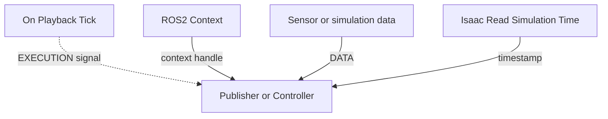

Read every graph in this order:

1. Find the `On Playback Tick` node.
2. Follow the dashed execution arrows.
3. Find the `ROS2 Context` node.
4. Follow the context connection.
5. Follow the solid data arrows.
6. Check every node's Property panel.
7. Press Play and validate the result in ROS2.

> **Important:** A graph is not complete when the nodes are merely present. A graph is complete only when the nodes, properties, and connections are correct.

> **Visual rule:** If an output port is connected, a visible wire must leave that port. If an input port is required, a visible wire must enter that input port.

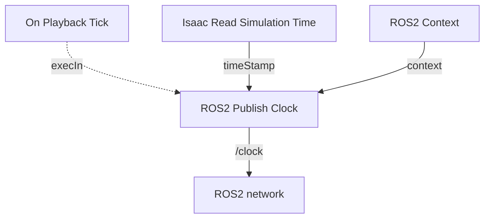

### Clock Graph: Required Port Connections

| Source node | Output port | Destination node | Input port | Connection type |
|---|---|---|---|---|
| `On Playback Tick` | `tick` | `ROS2 Publish Clock` | `execIn` | Execution |
| `ROS2 Context` | `context` | `ROS2 Publish Clock` | `context` | Data |
| `Isaac Read Simulation Time` | `simulationTime` | `ROS2 Publish Clock` | `timeStamp` | Data |

The final graph must visually resemble:

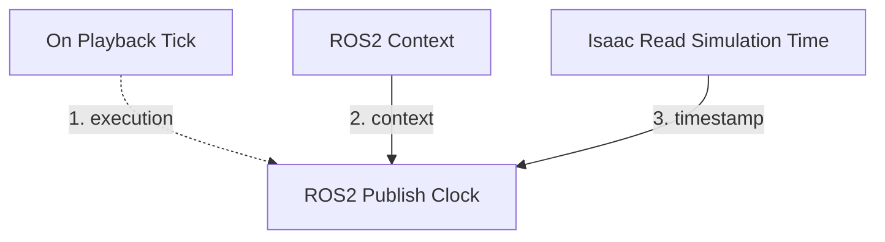

> **Stop and verify:** Do not continue until the graph contains all three connections shown above.

## B1. Select the graph parent

In the Stage panel, select:

```text
World
```

The new graph will be created below:

```text
/World
```

## B2. Open the Action Graph editor

Open:

```text
Window → Graph Editors → Action Graph
```

An Action Graph panel should appear.

Click:

```text
New Action Graph
```

Name the graph:

```text
ROS_Clock
```

The expected graph path is:

```text
/World/ROS_Clock
```

## B3. Add the required nodes

In the Action Graph node search panel, search for and add these nodes:

1. `On Playback Tick`
2. `ROS2 Context`
3. `Isaac Read Simulation Time`
4. `ROS2 Publish Clock`

Place the nodes from left to right in this order:

```text
On Playback Tick
        │
        ├── Isaac Read Simulation Time
        │
        └── ROS2 Publish Clock
```

Use the following recommended layout. The exact pixel position is not required, but keeping the graph arranged this way makes it easier to debug.

```text
Left column                  Middle column             Right column

On Playback Tick  ────────▶  ROS2 Publish Clock
                                      ▲
ROS2 Context  ──────────────────────┘
                                      ▲
Isaac Read Simulation Time ───────────┘
```


## B4. Configure the ROS2 Context node

Select:

```text
ROS2 Context
```

In the Property panel, configure:

```text
Domain ID = 0
Use Domain ID Environment Variable = Disabled
```

If the field is named `useDomainIDEnvVar`, set it to:

```text
False
```

The ROS2 Context node must provide its context output to the ROS2 Publish Clock node.

Connect:

```text
ROS2 Context.outputs:context
    →
ROS2 Publish Clock.inputs:context
```

## B5. Configure Isaac Read Simulation Time

Select:

```text
Isaac Read Simulation Time
```

Use simulation time.

If the node contains a property named:

```text
resetOnStop
```

set it to:

```text
False
```

Leave reference time numerator and denominator at their default values.

The output should be:

```text
simulationTime
```

## B6. Configure the ROS2 Publish Clock node

Select:

```text
ROS2 Publish Clock
```

Set:

```text
Topic Name = /clock
Queue Size = 10
```

If `qosProfile` is available, leave it at its default value.

Connect:

```text
On Playback Tick.outputs:tick
    →
ROS2 Publish Clock.inputs:execIn
```

Connect:

```text
Isaac Read Simulation Time.outputs:simulationTime
    →
ROS2 Publish Clock.inputs:timeStamp
```

The final connections must include:

```text
On Playback Tick.tick
    → ROS2 Publish Clock.execIn

ROS2 Context.context
    → ROS2 Publish Clock.context

Isaac Read Simulation Time.simulationTime
    → ROS2 Publish Clock.timeStamp
```

## B7. Test `/clock`

Press Play in Isaac Sim.

Open a separate terminal and run:

```bash
source /opt/ros/humble/setup.bash
export ROS_DOMAIN_ID=0
ros2 topic list | grep clock
```

Expected output:

```text
/clock
```

Now run:

```bash
ros2 topic echo /clock --once
```

Expected output contains:

```text
clock:
  sec: ...
  nanosec: ...
```

Check the publishing rate:

```bash
ros2 topic hz /clock
```

The rate should be greater than zero.

Press Ctrl+C to stop `ros2 topic hz`.

If `/clock` does not appear:

1. Confirm Isaac Sim is playing.
2. Confirm the graph path is `/World/ROS_Clock`.
3. Confirm the ROS2 Context is connected.
4. Confirm `On Playback Tick.tick` is connected to `ROS2 Publish Clock.execIn`.
5. Confirm the topic name is exactly `/clock`.
6. Confirm the terminal sourced ROS2 Humble.

### Validation checkpoint B

The following command must succeed:

```bash
ros2 topic echo /clock --once
```

#### Evidence to Capture

<!--  -->

Take one screenshot showing:

- The complete `ROS_Clock` Action Graph.
- All four nodes.
- All three connections.
- The Property panel for `ROS2 Publish Clock`.
- The topic name `/clock`.

The screenshot must be readable. Do not submit a screenshot in which the node names or wires cannot be read.

Save the stage as:

```text
~/RAS545/Lab3/work/Lab3_01_ros_clock.usda
```

---

# Part C: Create the TurtleBot Drive Action Graph

## Objective

You will create a ROS2 subscriber for:

```text
/cmd_vel
```

The subscriber will receive:

```text
geometry_msgs/msg/Twist
```

The command will be converted into wheel velocities using a differential-drive controller.

The required signal flow is:

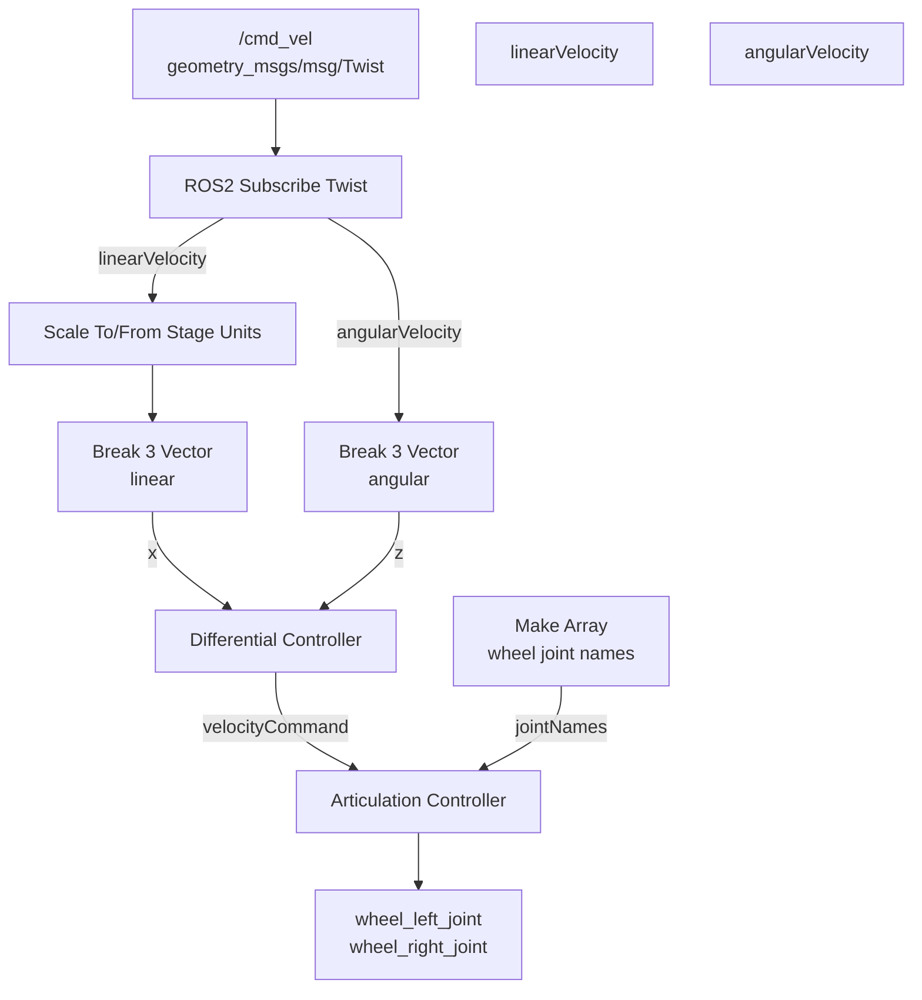

The graph also requires an execution signal:

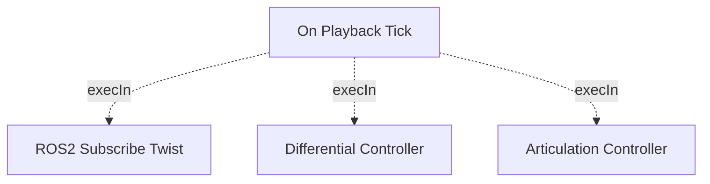

The first diagram shows data flow. The second diagram shows execution flow.

Both diagrams are required.

The differential-drive parameters are:

```text
Maximum linear speed = 0.22 m/s
Maximum angular speed = 1.0 rad/s
Wheel distance = 0.16 m
Wheel radius = 0.025 m
```

## C1. Select the robot root

In the Stage panel, select:

```text
turtlebot3_burger
```

Do not select `base_link` or a wheel link.

The graph will be created below:

```text
/turtlebot3_burger
```

## C2. Create the drive graph

Open:

```text
Window → Graph Editors → Action Graph
```

Click:

```text
New Action Graph
```

Name the graph:

```text
ROS_Drive
```

The expected graph path is:

```text
/turtlebot3_burger/ROS_Drive
```

## C3. Add the graph nodes

Add the following nodes:

1. `On Playback Tick`
2. `ROS2 Context`
3. `ROS2 Subscribe Twist`
4. `Scale To/From Stage Units`
5. `Break 3 Vector`
6. `Break 3 Vector`
7. `Differential Controller`
8. `Constant Token`
9. `Constant Token`
10. `Make Array`
11. `Articulation Controller`

> **Version note:** Search for `Make Array`. If your Isaac Sim installation displays the equivalent node as `Construct Array`, use that node but rename the node instance to `make_array` so that all port references remain consistent.

<!-- Rename the nodes so they are easy to identify:

```text
on_playback_tick
ros2_context
ros2_subscribe_twist
scale_linear_velocity
break_linear_velocity
break_angular_velocity
differential_controller
constant_left_joint
constant_right_joint
make_array
articulation_controller
``` -->

If Isaac Sim automatically assigns different names, that is acceptable. The node types and properties must be correct.

### Drive Graph Connection Table

Connect one row at a time. After each connection, verify that the wire remains attached to the correct port.

| Step | Source node | Output port | Destination node | Input port |
|---:|---|---|---|---|
| 1 | `on_playback_tick` | `outputs:tick` | `ros2_subscribe_twist` | `inputs:execIn` |
| 2 | `on_playback_tick` | `outputs:tick` | `differential_controller` | `inputs:execIn` |
| 3 | `on_playback_tick` | `outputs:tick` | `articulation_controller` | `inputs:execIn` |
| 4 | `ros2_context` | `outputs:context` | `ros2_subscribe_twist` | `inputs:context` |
| 5 | `ros2_subscribe_twist` | `outputs:linearVelocity` | `scale_linear_velocity` | `inputs:value` |
| 6 | `scale_linear_velocity` | `outputs:result` | `break_linear_velocity` | `inputs:tuple` |
| 7 | `break_linear_velocity` | `outputs:x` | `differential_controller` | `inputs:linearVelocity` |
| 8 | `ros2_subscribe_twist` | `outputs:angularVelocity` | `break_angular_velocity` | `inputs:tuple` |
| 9 | `break_angular_velocity` | `outputs:z` | `differential_controller` | `inputs:angularVelocity` |
| 10 | `differential_controller` | `outputs:velocityCommand` | `articulation_controller` | `inputs:velocityCommand` |
| 11 | `constant_left_joint` | `outputs:value` | `make_array` | `inputs:input0` |
| 12 | `constant_right_joint` | `outputs:value` | `make_array` | `inputs:input1` |
| 13 | `make_array` | `outputs:array` | `articulation_controller` | `inputs:jointNames` |

> **Common error:** Connect `angularVelocity.z`, not `angularVelocity.x` or `angularVelocity.y`.

> **Common error:** Connect `linearVelocity.x`, not the entire three-dimensional vector.

> **Common error:** The wheel order must be `wheel_left_joint` followed by `wheel_right_joint`.

## C4. Configure the ROS2 Context

Select the ROS2 Context node.

Set:

```text
Domain ID = 0
Use Domain ID Environment Variable = Disabled
```

Connect:

```text
ROS2 Context.outputs:context
    →
ROS2 Subscribe Twist.inputs:context
```

## C5. Configure the Twist subscriber

Select:

```text
ROS2 Subscribe Twist
```

Set:

```text
Topic Name = /cmd_vel
Queue Size = 10
```

If `qosProfile` is available, leave it at the default value.

The node must subscribe to:

```text
geometry_msgs/msg/Twist
```

The node produces:

```text
linearVelocity
angularVelocity
```

Connect:

```text
On Playback Tick.outputs:tick
    →
ROS2 Subscribe Twist.inputs:execIn
```

Do not connect the subscriber execution output to the differential controller execution input. The differential controller must execute every simulation frame.

## C6. Configure the linear velocity conversion

Select the first `Break 3 Vector` node and rename it:

```text
break_linear_velocity
```

Connect:

```text
ROS2 Subscribe Twist.outputs:linearVelocity
    →
Scale To/From Stage Units.inputs:value
```

Set the scale node conversion to:

```text
Convert to stage units
```

Connect:

```text
Scale To/From Stage Units.outputs:result
    →
break_linear_velocity.inputs:tuple
```

The `break_linear_velocity` node produces:

```text
x
y
z
```

Connect the X component:

```text
break_linear_velocity.outputs:x
    →
Differential Controller.inputs:linearVelocity
```

Do not use the Y or Z components.

## C7. Configure angular velocity

Select the second `Break 3 Vector` node and rename it:

```text
break_angular_velocity
```

Connect:

```text
ROS2 Subscribe Twist.outputs:angularVelocity
    →
break_angular_velocity.inputs:tuple
```

The node produces:

```text
x
y
z
```

Connect the Z component:

```text
break_angular_velocity.outputs:z
    →
Differential Controller.inputs:angularVelocity
```

Do not use the X or Y components.

## C8. Configure the Differential Controller

Select:

```text
Differential Controller
```

Set the following values:

```text
Max Linear Speed = 0.22
Max Angular Speed = 1.0
Wheel Distance = 0.16
Wheel Radius = 0.025
```

Leave the following values at their defaults unless your instructor provides different values:

```text
Max Acceleration
Max Deceleration
Max Angular Acceleration
Max Wheel Speed
```

Connect:

```text
On Playback Tick.outputs:tick
    →
Differential Controller.inputs:execIn
```

The differential controller produces:

```text
velocityCommand
```

## C9. Configure the wheel joint names

Select the first Constant Token node.

Set:

```text
Value = wheel_left_joint
```

Select the second Constant Token node.

Set:

```text
Value = wheel_right_joint
```

The order is important:

```text
Index 0: wheel_left_joint
Index 1: wheel_right_joint
```

Connect:

```text
constant_left_joint.outputs:value
    →
make_array.inputs:input0
```

Connect:

```text
constant_right_joint.outputs:value
    →
make_array.inputs:input1
```

Select:

```text
Make Array
```

Set:

```text
Array Size = 2
Array Type = token[]
```

Connect:

```text
make_array.outputs:array
    →
articulation_controller.inputs:jointNames
```

## C10. Configure the Articulation Controller

Select:

```text
Articulation Controller
```

Set the target prim to:

```text
/turtlebot3_burger/base_footprint
```

If the Property panel provides a prim picker:

1. Click the picker icon.
2. Select `/turtlebot3_burger/base_footprint` in the Stage panel.
3. Confirm the selected target.

Connect:

```text
On Playback Tick.outputs:tick
    →
Articulation Controller.inputs:execIn
```

Connect:

```text
Differential Controller.outputs:velocityCommand
    →
Articulation Controller.inputs:velocityCommand
```

The final drive graph must contain these connections:

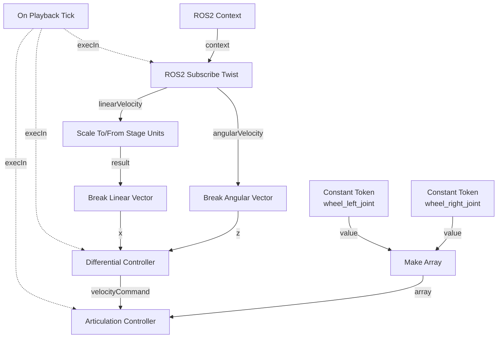

## C11. Test the drive graph

### Final Drive Graph Appearance

Before pressing Play, compare your graph with this structure:

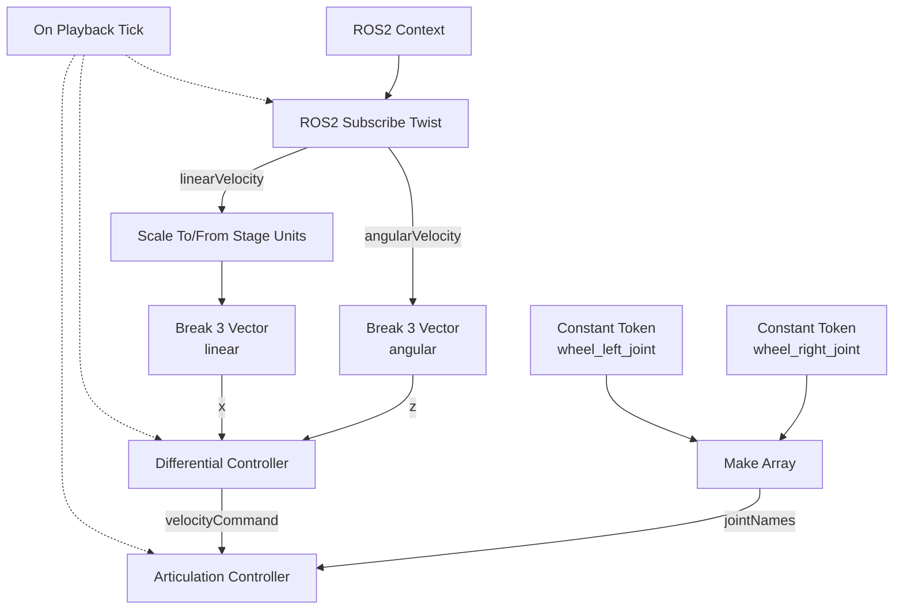

> **Checkpoint:** If your graph does not contain three dashed execution wires from `On Playback Tick`, stop and repair the graph before testing.

Press Play in Isaac Sim.

In a sourced terminal, verify that the command topic exists:

```bash
source /opt/ros/humble/setup.bash
export ROS_DOMAIN_ID=0
ros2 topic list | grep cmd_vel
```

Expected output:

```text
/cmd_vel
```

Send a slow forward command:

```bash
ros2 topic pub --rate 5 /cmd_vel geometry_msgs/msg/Twist \
"{linear: {x: 0.10, y: 0.0, z: 0.0}, angular: {x: 0.0, y: 0.0, z: 0.0}}"
```

The robot should move forward slowly.

Stop the command with:

```text
Ctrl+C
```

Immediately send a zero command:

```bash
ros2 topic pub --once /cmd_vel geometry_msgs/msg/Twist \
"{linear: {x: 0.0, y: 0.0, z: 0.0}, angular: {x: 0.0, y: 0.0, z: 0.0}}"
```

Test rotation:

```bash
ros2 topic pub --rate 5 /cmd_vel geometry_msgs/msg/Twist \
"{linear: {x: 0.0, y: 0.0, z: 0.0}, angular: {x: 0.0, y: 0.0, z: 0.5}}"
```

The robot should rotate counterclockwise.

Stop the command with:

```text
Ctrl+C
```

Send another zero command.

### Drive troubleshooting

If the robot does not move, check:

```text
Topic name = /cmd_vel
Message type = geometry_msgs/msg/Twist
Target prim = /turtlebot3_burger/base_footprint
Left joint = wheel_left_joint
Right joint = wheel_right_joint
Wheel distance = 0.16
Wheel radius = 0.025
```

If the robot moves backward:

- Check the sign of the linear velocity.
- Check the wheel joint order.
- Check the wheel joint axis.
- Check whether the left and right joint names were reversed.

If the robot spins while commanded forward:

- Check the wheel joint order.
- Check the wheel radius.
- Check the wheel distance.
- Check the wheel joint orientations.

### Validation checkpoint C

The robot must:

- Move forward using `/cmd_vel`.
- Stop when a zero command is sent.
- Rotate using angular velocity.
- Remain physically stable.

#### Evidence to Capture

<!--  -->

Take one screenshot showing:

- The complete `ROS_Drive` graph.
- The three dashed execution connections from `On Playback Tick`.
- The `Differential Controller`.
- The `Articulation Controller`.
- The two wheel joint names.
- The Property panel showing:
  - `Max Linear Speed = 0.22`
  - `Max Angular Speed = 1.0`
  - `Wheel Distance = 0.16`
  - `Wheel Radius = 0.025`

Save the stage as:

```text
~/RAS545/Lab3/work/Lab3_02_ros_drive.usda
```

---

# Part D: Add and Publish a 2D RTX Lidar

## Objective

You will add a 2D RTX lidar sensor and publish:

```text
/scan
```

The ROS message type must be:

```text
sensor_msgs/msg/LaserScan
```

The sensor frame will be:

```text
base_scan
```

The official Isaac Sim RTX lidar tutorial is available at:

[Isaac Sim 6.0.1 RTX Lidar Sensors](https://docs.isaacsim.omniverse.nvidia.com/6.0.1/ros2_tutorials/tutorial_ros2_rtx_lidar.html)

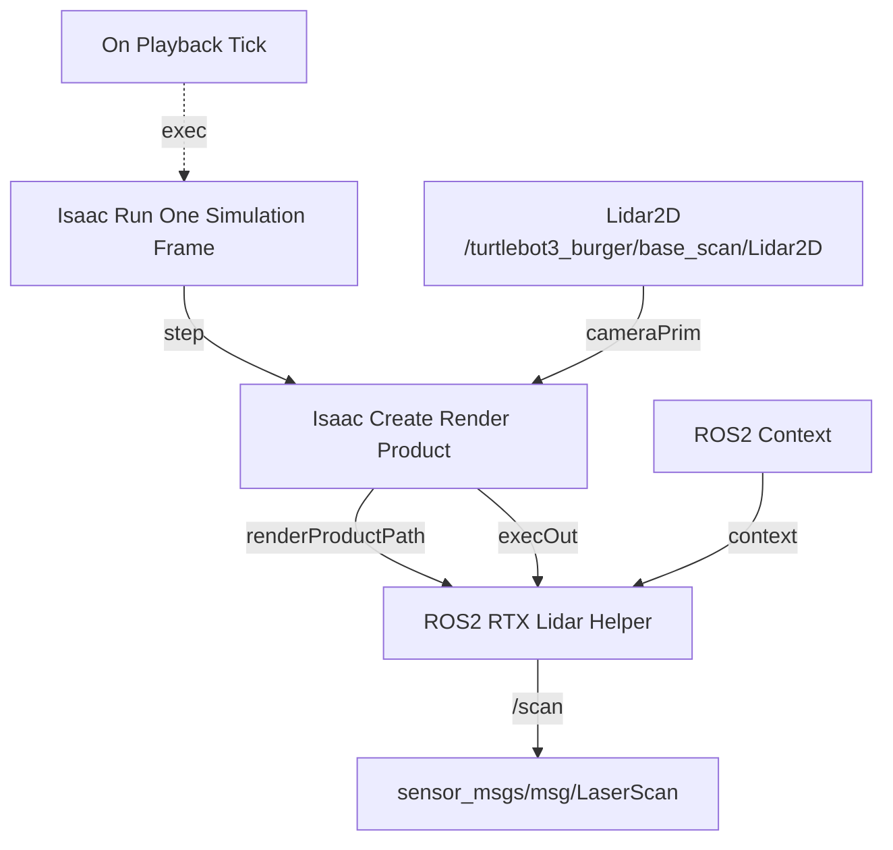

Required helper properties:

```text
Type = laser_scan
Topic Name = /scan
Frame ID = base_scan
Enabled = True
Queue Size = 10
```

If the helper exposes a `Use System Time` property, leave it disabled unless the instructor explicitly instructs otherwise.

## D1. Stop simulation

Before adding the sensor, press:

```text
Stop
```

Do not add or move an RTX lidar while the simulation is running.

## D2. Select the lidar mounting link

In the Stage panel, select:

```text
/turtlebot3_burger/base_scan
```

This link is already part of the TurtleBot model.

The existing `base_scan` link has approximately:

```text
Translation relative to base_link:
X = -0.032 m
Y = 0.000 m
Z = 0.182 m

Rotation:
X = 0 degrees
Y = 0 degrees
Z = 0 degrees
```

Do not change the `base_scan` link transform.

## D3. Create the RTX lidar

Use the Isaac Sim menu:

```text
Create → Sensors → RTX Lidar → NVIDIA → Example Rotary 2D
```

A new lidar prim will be created.

Rename the new sensor:

```text
Lidar2D
```

Move or reparent the sensor under:

```text
/turtlebot3_burger/base_scan
```

The final sensor path must be:

```text
/turtlebot3_burger/base_scan/Lidar2D
```

If Isaac Sim initially creates the sensor under `/World`, drag it in the Stage panel onto:

```text
base_scan
```

When Isaac Sim asks whether to reparent the prim, accept the operation.

## D4. Configure the lidar transform

Select:

```text
/turtlebot3_burger/base_scan/Lidar2D
```

In the Property panel, open the Transform section.

Set the sensor transform relative to `base_scan`:

```text
Translation:
X = 0.000 m
Y = 0.000 m
Z = 0.000 m

Rotation:
X = 0 degrees
Y = 0 degrees
Z = 0 degrees

Scale:
X = 1
Y = 1
Z = 1
```

The sensor should overlap the visual lidar housing.

Do not use a second lidar.

Do not add:

```text
Example_Rotary
```

or:

```text
Example_Rotary_2D
```

as an additional sensor.

## D5. Configure lidar rate

Select:

```text
/turtlebot3_burger/base_scan/Lidar2D
```

In the Property panel, search for:

```text
tickRate
```

Set:

```text
omni:sensor:tickRate = 10 Hz
```

If the sensor exposes a scan-rate property, set:

```text
scanRateBaseHz = 10 Hz
```

The tick rate and scan rate should match.

In Isaac Sim 6.0, the sensor tick rate controls the publish rate. The older `frameSkipCount` setting should not be used as the primary rate control.

## D6. Create the lidar Action Graph

### Lidar Sensor and Lidar Graph Are Different Objects

The lidar system contains two separate parts:

1. The physical or simulated sensor prim.
2. The ROS2 Action Graph that publishes the sensor data.

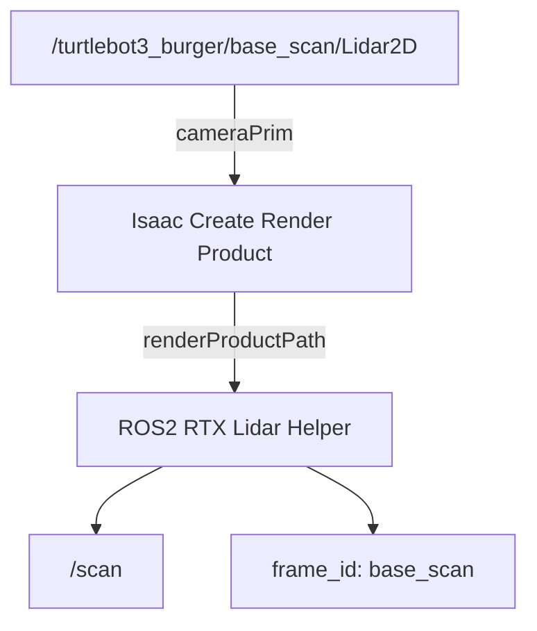

Do not confuse:

```text
/turtlebot3_burger/base_scan/Lidar2D
```

with:

```text
/turtlebot3_burger/base_scan/Lidar2D/ROS_Lidar2D
```

The first is the sensor. The second is the Action Graph.

Select the lidar prim:

```text
/turtlebot3_burger/base_scan/Lidar2D
```

Open:

```text
Window → Graph Editors → Action Graph
```

Click:

```text
New Action Graph
```

Name it:

```text
ROS_Lidar2D
```

The expected graph path is:

```text
/turtlebot3_burger/base_scan/Lidar2D/ROS_Lidar2D
```

## D7. Add lidar graph nodes

Add:

1. `On Playback Tick`
2. `ROS2 Context`
3. `Isaac Run One Simulation Frame`
4. `Isaac Create Render Product`
5. `ROS2 RTX Lidar Helper`

Arrange them:

```text
On Playback Tick
        ↓
Isaac Run One Simulation Frame
        ↓
Isaac Create Render Product
        ↓
ROS2 RTX Lidar Helper
```

## D8. Configure the lidar graph

<!--  -->

Configure the ROS2 Context:

```text
Domain ID = 0
Use Domain ID Environment Variable = Disabled
```

Configure `Isaac Create Render Product`:

```text
Camera Prim = /turtlebot3_burger/base_scan/Lidar2D
Enabled = True
```

If width and height fields are visible, use:

```text
Width = 640
Height = 480
```

The exact resolution is not used by the LaserScan message, but these values provide a predictable render-product configuration.

Configure `ROS2 RTX Lidar Helper`:

```text
Type = laser_scan
Topic Name = /scan
Frame ID = base_scan
Enabled = True
```

If the helper exposes a `Use System Time` property, leave it disabled unless told otherwise.

If `qosProfile` is available, leave it at the default value.

Set:

```text
Queue Size = 10
```

Leave:

```text
Frame Skip Count
```

at its default value.

Connect:

```text
On Playback Tick.outputs:tick
    →
Isaac Run One Simulation Frame.inputs:execIn
```

Connect:

```text
Isaac Run One Simulation Frame.outputs:step
    →
Isaac Create Render Product.inputs:execIn
```

Connect:

```text
Isaac Create Render Product.outputs:execOut
    →
ROS2 RTX Lidar Helper.inputs:execIn
```

Connect:

```text
Isaac Create Render Product.outputs:renderProductPath
    →
ROS2 RTX Lidar Helper.inputs:renderProductPath
```

Connect:

```text
ROS2 Context.outputs:context
    →
ROS2 RTX Lidar Helper.inputs:context
```

Set the render product camera prim exactly to:

```text
/turtlebot3_burger/base_scan/Lidar2D
```

## D9. Test `/scan`

Press Play.

In a sourced terminal, run:

```bash
source /opt/ros/humble/setup.bash
export ROS_DOMAIN_ID=0
ros2 topic list | grep scan
```

Expected output:

```text
/scan
```

Check the message type:

```bash
ros2 topic type /scan
```

Expected output:

```text
sensor_msgs/msg/LaserScan
```

Check the rate:

```bash
ros2 topic hz /scan
```

The rate should be greater than zero.

Check one message:

```bash
ros2 topic echo /scan --once
```

Verify:

```text
header.frame_id: base_scan
```

The message should also contain:

```text
angle_min
angle_max
angle_increment
range_min
range_max
ranges
```

## D10. View the lidar in RViz2

Start RViz2:

```bash
rviz2 --ros-args -p use_sim_time:=true
```

In RViz2:

1. Set **Fixed Frame** to:

   ```text
   base_scan
   ```

2. Click:

   ```text
   Add
   ```

3. Select:

   ```text
   LaserScan
   ```

4. Set the LaserScan topic to:

   ```text
   /scan
   ```

5. Set the LaserScan size to:

   ```text
   0.03 m
   ```

6. Set the LaserScan color to a visible color.

The lidar scan should be visible around the robot.

At this stage, it is acceptable to use `base_scan` as the RViz Fixed Frame because the complete robot TF tree has not yet been created.

### Validation checkpoint D

The following commands must succeed:

```bash
ros2 topic type /scan
ros2 topic hz /scan
ros2 topic echo /scan --once
```
#### Evidence to Capture

Take one screenshot showing:

- The `Lidar2D` prim under `base_scan`.
- The lidar transform values.
- The complete `ROS_Lidar2D` graph.
- The ROS2 RTX Lidar Helper properties.
- `/scan` visible in RViz2.

Save:

```text
~/RAS545/Lab3/work/Lab3_03_lidar.usda
```

---

# Part E: Add and Publish a Camera

## Objective

You will add a camera to the TurtleBot and publish:

```text
/camera/image_raw
/camera/camera_info
```

The camera frame will be:

```text
Camera_1
```

The official Isaac Sim camera tutorial is available at:

[Isaac Sim 6.0.1 ROS2 Cameras](https://docs.isaacsim.omniverse.nvidia.com/6.0.1/ros2_tutorials/tutorial_ros2_camera.html)

### Camera Graph Overview

The camera graph has one render-product pipeline and two ROS2 outputs.

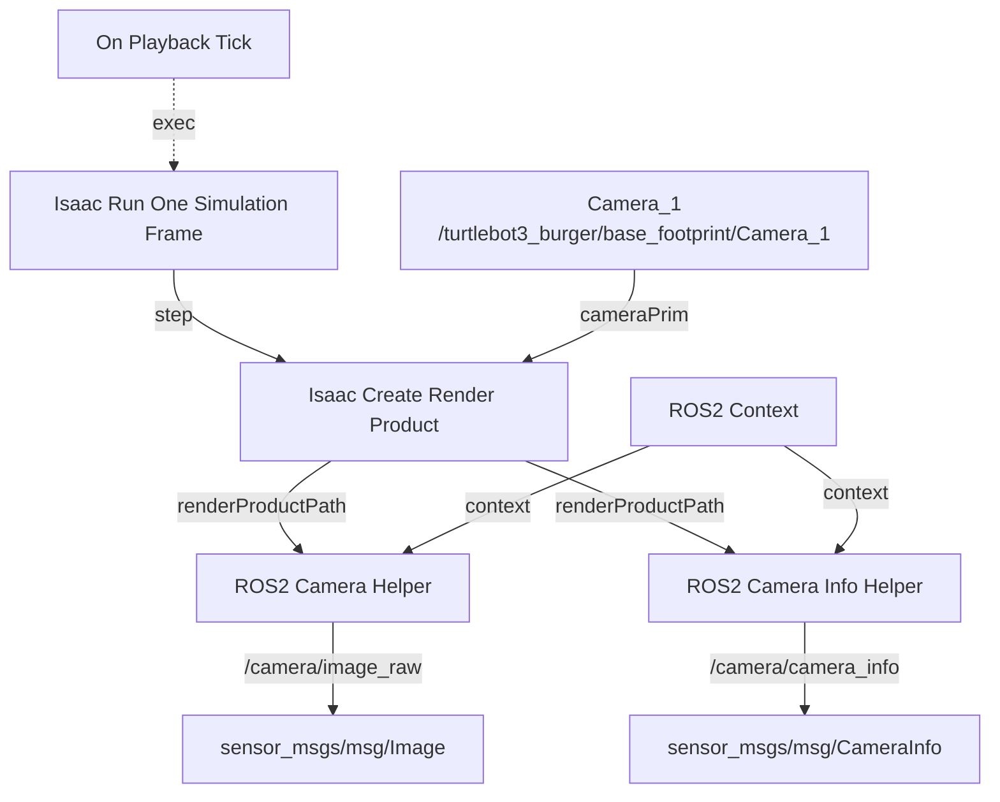

The camera graph must produce two independent ROS2 topics:

```text
/camera/image_raw
/camera/camera_info
```

> **Important:** The `ROS2 Camera Helper` and `ROS2 Camera Info Helper` are separate nodes. Each must receive the render-product path.

## E1. Stop simulation

Press:

```text
Stop
```

before adding the camera.

## E2. Select the camera parent

In the Stage panel, select:

```text
/turtlebot3_burger/base_footprint
```

The camera will be attached to `base_footprint`.

## E3. Create the camera

Use:

```text
Create → Camera
```

Rename the camera:

```text
Camera_1
```

Reparent the camera under:

```text
/turtlebot3_burger/base_footprint
```

The final camera path must be:

```text
/turtlebot3_burger/base_footprint/Camera_1
```

## E4. Configure the camera transform

Select:

```text
/turtlebot3_burger/base_footprint/Camera_1
```

In the Property panel, open Transform.

Set:

```text
Translation:
X = 0.100 m
Y = 0.000 m
Z = 0.200 m
```

Set the camera rotation using the Euler rotation fields:

```text
Rotation X = 90 degrees
Rotation Y = 0 degrees
Rotation Z = -90 degrees
```

Set:

```text
Scale X = 1
Scale Y = 1
Scale Z = 1
```

These values orient the camera approximately forward along the robot X axis.

The equivalent USD quaternion is approximately:

```text
(w, x, y, z) =
(0.5, 0.5, -0.5, -0.5)
```

If the camera is facing backward, set:

```text
Rotation Z = 90 degrees
```

instead and verify the camera view.

## E5. Configure camera properties

Select:

```text
Camera_1
```

Set:

```text
Focal Length = 18.0 mm
Clipping Range Near = 0.01 m
Clipping Range Far = 100.0 m
```

If the camera exposes an aperture setting, leave the default value.

If the camera has an `OmniSensorAPI` sensor-rate property, set:

```text
omni:sensor:tickRate = 10 Hz
```

Do not use `frameSkipCount` to define the camera rate unless specifically instructed by the teaching staff. Leave deprecated or unused rate fields at their default value and verify the actual rate using:

```bash
ros2 topic hz /camera/image_raw
```

## E6. Create the camera Action Graph

Select:

```text
/turtlebot3_burger/base_footprint/Camera_1
```

Open:

```text
Window → Graph Editors → Action Graph
```

Click:

```text
New Action Graph
```

Name it:

```text
ROS_Camera
```

The expected graph path is:

```text
/turtlebot3_burger/base_footprint/Camera_1/ROS_Camera
```

## E7. Add camera graph nodes

Add:

1. `On Playback Tick`
2. `ROS2 Context`
3. `Isaac Run One Simulation Frame`
4. `Isaac Create Render Product`
5. `ROS2 Camera Helper`
6. `ROS2 Camera Info Helper`

## E8. Configure the camera nodes

<!--  -->

Configure ROS2 Context:

```text
Domain ID = 0
Use Domain ID Environment Variable = Disabled
```

Configure Isaac Create Render Product:

```text
Camera Prim = /turtlebot3_burger/base_footprint/Camera_1
Enabled = True
Width = 640
Height = 480
```

Configure ROS2 Camera Helper:

```text
Type = rgb
Topic Name = /camera/image_raw
Frame ID = Camera_1
Enabled = True
Queue Size = 10
```

If the helper exposes a `Use System Time` property, leave it disabled unless told otherwise.

Configure ROS2 Camera Info Helper:

```text
Topic Name = /camera/camera_info
Frame ID = Camera_1
Enabled = True
Queue Size = 10
```

If the helper exposes a `Use System Time` property, leave it disabled unless told otherwise.

If a node contains a `frameSkipCount` field, leave it at the default value. In Isaac Sim 6.0, the sensor tick rate should be used to control the sensor rate.

## E9. Connect the camera graph

### Camera Graph Connection Table

| Source node | Output port | Destination node | Input port |
|---|---|---|---|
| `On Playback Tick` | `tick` | `Isaac Run One Simulation Frame` | `execIn` |
| `Isaac Run One Simulation Frame` | `step` | `Isaac Create Render Product` | `execIn` |
| `Isaac Create Render Product` | `execOut` | `ROS2 Camera Helper` | `execIn` |
| `Isaac Create Render Product` | `execOut` | `ROS2 Camera Info Helper` | `execIn` |
| `Isaac Create Render Product` | `renderProductPath` | `ROS2 Camera Helper` | `renderProductPath` |
| `Isaac Create Render Product` | `renderProductPath` | `ROS2 Camera Info Helper` | `renderProductPath` |
| `ROS2 Context` | `context` | `ROS2 Camera Helper` | `context` |
| `ROS2 Context` | `context` | `ROS2 Camera Info Helper` | `context` |

> **Checkpoint:** The render-product output must connect to both camera helper nodes.

Connect:

```text
On Playback Tick.outputs:tick
    →
Isaac Run One Simulation Frame.inputs:execIn
```

Connect:

```text
Isaac Run One Simulation Frame.outputs:step
    →
Isaac Create Render Product.inputs:execIn
```

Connect:

```text
Isaac Create Render Product.outputs:execOut
    →
ROS2 Camera Helper.inputs:execIn
```

Connect:

```text
Isaac Create Render Product.outputs:execOut
    →
ROS2 Camera Info Helper.inputs:execIn
```

Connect:

```text
Isaac Create Render Product.outputs:renderProductPath
    →
ROS2 Camera Helper.inputs:renderProductPath
```

Connect:

```text
Isaac Create Render Product.outputs:renderProductPath
    →
ROS2 Camera Info Helper.inputs:renderProductPath
```

Connect:

```text
ROS2 Context.outputs:context
    →
ROS2 Camera Helper.inputs:context
```

Connect:

```text
ROS2 Context.outputs:context
    →
ROS2 Camera Info Helper.inputs:context
```

## E10. Test camera topics

Press Play.

In a sourced terminal, run:

```bash
source /opt/ros/humble/setup.bash
export ROS_DOMAIN_ID=0
ros2 topic list | grep camera
```

Expected output includes:

```text
/camera/image_raw
/camera/camera_info
```

Check the image message type:

```bash
ros2 topic type /camera/image_raw
```

Expected:

```text
sensor_msgs/msg/Image
```

Check the camera information message type:

```bash
ros2 topic type /camera/camera_info
```

Expected:

```text
sensor_msgs/msg/CameraInfo
```

Check the image rate:

```bash
ros2 topic hz /camera/image_raw
```

Check one camera message:

```bash
ros2 topic echo /camera/image_raw --once
```

## E11. View the image

Run:

```bash
ros2 run rqt_image_view rqt_image_view
```

In the `rqt_image_view` window, select:

```text
/camera/image_raw
```

The image should show the simulated environment.

If the image is black:

1. Verify that Isaac Sim is playing.
2. Verify that the render product is enabled.
3. Verify that the camera is facing the environment.
4. Verify that the ROS2 Camera Helper type is `rgb`.
5. Verify that the topic is `/camera/image_raw`.
6. Confirm that the camera is not inside the robot mesh.

### Validation checkpoint E

The following commands must succeed:

```bash
ros2 topic type /camera/image_raw
ros2 topic type /camera/camera_info
ros2 topic hz /camera/image_raw
```
#### Evidence to Capture

Take one screenshot showing:

- `Camera_1` under `base_footprint`.
- Camera translation:
  - `X = 0.100`
  - `Y = 0.000`
  - `Z = 0.200`
- Camera rotation:
  - `X = 90`
  - `Y = 0`
  - `Z = -90`
- The complete `ROS_Camera` graph.
- The camera image in `rqt_image_view`.

Save:

```text
~/RAS545/Lab3/work/Lab3_04_camera.usda
```

---

# Part F: Publish Odometry and Robot TF

## Objective

You will publish:

```text
/odom
/tf
```

The odometry frame relationship must be:

```text
odom → base_footprint
```

The robot link tree must be:

```text
base_footprint → base_link
base_footprint → base_scan
base_footprint → wheel_left_link
base_footprint → wheel_right_link
base_footprint → caster_back_link
base_footprint → Camera_1
```

Do not publish:

```text
world → odom
```

The official Isaac Sim transform and odometry tutorial is available at:

[Isaac Sim 6.0.1 ROS2 Transform Trees and Odometry](https://docs.isaacsim.omniverse.nvidia.com/6.0.1/ros2_tutorials/tutorial_ros2_tf.html)

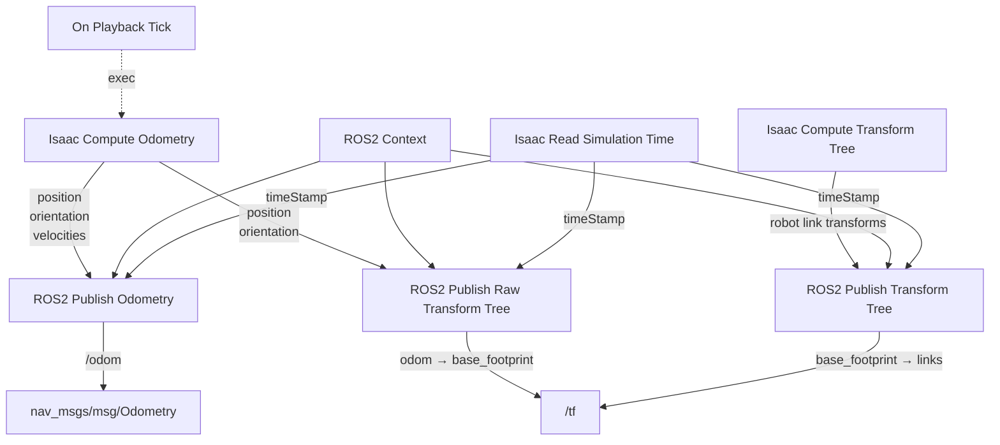

The odometry graph must publish:

```text
odom → base_footprint
```

The odometry graph must not publish:

```text
world → odom
```

AMCL will publish the later transform:

```text
map → odom
```

The final localization tree is therefore:

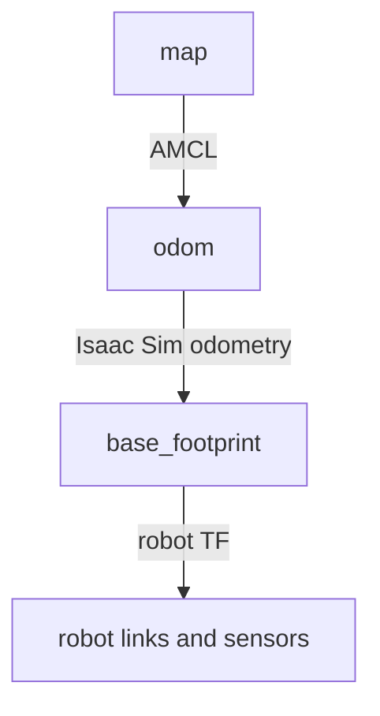

## F1. Select the robot root

In the Stage panel, select:

```text
/turtlebot3_burger
```

Create the graph below the robot root.

## F2. Create the odometry graph

Open:

```text
Window → Graph Editors → Action Graph
```

Click:

```text
New Action Graph
```

Name the graph:

```text
ROS_OdomTF
```

The expected graph path is:

```text
/turtlebot3_burger/ROS_OdomTF
```

## F3. Add the odometry and TF nodes

Add:

1. `On Playback Tick`
2. `ROS2 Context`
3. `Isaac Read Simulation Time`
4. `Isaac Compute Odometry`
5. `ROS2 Publish Odometry`
6. `ROS2 Publish Raw Transform Tree`
7. `Isaac Compute Transform Tree`
8. `ROS2 Publish Transform Tree`

## F4. Configure the ROS2 Context

Set:

```text
Domain ID = 0
Use Domain ID Environment Variable = Disabled
```

## F5. Configure simulation time

Select:

```text
Isaac Read Simulation Time
```

If `resetOnStop` exists, set:

```text
resetOnStop = False
```

Use its output:

```text
simulationTime
```

as the timestamp for the odometry and TF publisher nodes.

## F6. Configure Isaac Compute Odometry

Select:

```text
Isaac Compute Odometry
```

Set:

```text
Chassis Prim = /turtlebot3_burger/base_footprint
```

The node calculates:

```text
position
orientation
linearVelocity
angularVelocity
```

Connect:

```text
On Playback Tick.outputs:tick
    →
Isaac Compute Odometry.inputs:execIn
```

## F7. Configure ROS2 Publish Odometry

Select:

```text
ROS2 Publish Odometry
```

Set:

```text
Chassis Frame ID = base_footprint
Odom Frame ID = odom
Topic Name = /odom
Queue Size = 10
```

Connect:

```text
ROS2 Context.outputs:context
    →
ROS2 Publish Odometry.inputs:context
```

Connect:

```text
Isaac Compute Odometry.outputs:execOut
    →
ROS2 Publish Odometry.inputs:execIn
```

Connect:

```text
Isaac Compute Odometry.outputs:position
    →
ROS2 Publish Odometry.inputs:position
```

Connect:

```text
Isaac Compute Odometry.outputs:orientation
    →
ROS2 Publish Odometry.inputs:orientation
```

Connect:

```text
Isaac Compute Odometry.outputs:linearVelocity
    →
ROS2 Publish Odometry.inputs:linearVelocity
```

Connect:

```text
Isaac Compute Odometry.outputs:angularVelocity
    →
ROS2 Publish Odometry.inputs:angularVelocity
```

Connect:

```text
Isaac Read Simulation Time.outputs:simulationTime
    →
ROS2 Publish Odometry.inputs:timeStamp
```

## F8. Configure the odom-to-base transform

Select:

```text
ROS2 Publish Raw Transform Tree
```

This node must publish the transform:

```text
odom → base_footprint
```

Set:

```text
Parent Frame ID = odom
Child Frame ID = base_footprint
Topic Name = /tf
Queue Size = 10
Static Publisher = False
```

Connect:

```text
ROS2 Context.outputs:context
    →
ROS2 Publish Raw Transform Tree.inputs:context
```

Connect:

```text
Isaac Compute Odometry.outputs:execOut
    →
ROS2 Publish Raw Transform Tree.inputs:execIn
```

Connect:

```text
Isaac Compute Odometry.outputs:position
    →
ROS2 Publish Raw Transform Tree.inputs:translation
```

Connect:

```text
Isaac Compute Odometry.outputs:orientation
    →
ROS2 Publish Raw Transform Tree.inputs:rotation
```

Connect:

```text
Isaac Read Simulation Time.outputs:simulationTime
    →
ROS2 Publish Raw Transform Tree.inputs:timeStamp
```

Do not set the parent frame to `world`.

Do not set the child frame to `odom`.

The required values are:

```text
Parent Frame ID = odom
Child Frame ID = base_footprint
```

## F9. Configure the robot link transform tree

Select:

```text
Isaac Compute Transform Tree
```

Set:

```text
Parent Prim = /turtlebot3_burger/base_footprint
```

Set the target prims to:

```text
/turtlebot3_burger/base_link
/turtlebot3_burger/base_scan
/turtlebot3_burger/caster_back_link
/turtlebot3_burger/wheel_left_link
/turtlebot3_burger/wheel_right_link
/turtlebot3_burger/base_footprint/Camera_1
```

If the node accepts the robot root as a single target, use:

```text
/turtlebot3_burger
```

The robot root already contains the Isaac Robot API and robot link list.

## F10. Configure ROS2 Publish Transform Tree

Select:

```text
ROS2 Publish Transform Tree
```

Set:

```text
Topic Name = /tf
Queue Size = 10
Static Publisher = False
```

Connect:

```text
ROS2 Context.outputs:context
    →
ROS2 Publish Transform Tree.inputs:context
```

Connect:

```text
On Playback Tick.outputs:tick
    →
Isaac Compute Transform Tree.inputs:execIn
```

Connect:

```text
Isaac Compute Transform Tree.outputs:execOut
    →
ROS2 Publish Transform Tree.inputs:execIn
```

Connect:

```text
Isaac Compute Transform Tree.outputs:parentFrames
    →
ROS2 Publish Transform Tree.inputs:parentFrames
```

Connect:

```text
Isaac Compute Transform Tree.outputs:childFrames
    →
ROS2 Publish Transform Tree.inputs:childFrames
```

Connect:

```text
Isaac Compute Transform Tree.outputs:translations
    →
ROS2 Publish Transform Tree.inputs:translations
```

Connect:

```text
Isaac Compute Transform Tree.outputs:orientations
    →
ROS2 Publish Transform Tree.inputs:orientations
```

Connect:

```text
Isaac Read Simulation Time.outputs:simulationTime
    →
ROS2 Publish Transform Tree.inputs:timeStamp
```

### TF Graph Connection Table

| Source | Output | Destination | Input |
|---|---|---|---|
| `On Playback Tick` | `tick` | `Isaac Compute Odometry` | `execIn` |
| `Isaac Compute Odometry` | `execOut` | `ROS2 Publish Raw Transform Tree` | `execIn` |
| `On Playback Tick` | `tick` | `Isaac Compute Transform Tree` | `execIn` |
| `Isaac Compute Odometry` | `execOut` | `ROS2 Publish Odometry` | `execIn` |
| `Isaac Compute Odometry` | `position` | `ROS2 Publish Odometry` | `position` |
| `Isaac Compute Odometry` | `orientation` | `ROS2 Publish Odometry` | `orientation` |
| `Isaac Compute Odometry` | `linearVelocity` | `ROS2 Publish Odometry` | `linearVelocity` |
| `Isaac Compute Odometry` | `angularVelocity` | `ROS2 Publish Odometry` | `angularVelocity` |
| `Isaac Compute Odometry` | `position` | `ROS2 Publish Raw Transform Tree` | `translation` |
| `Isaac Compute Odometry` | `orientation` | `ROS2 Publish Raw Transform Tree` | `rotation` |
| `Isaac Compute Transform Tree` | `parentFrames` | `ROS2 Publish Transform Tree` | `parentFrames` |
| `Isaac Compute Transform Tree` | `childFrames` | `ROS2 Publish Transform Tree` | `childFrames` |
| `Isaac Compute Transform Tree` | `translations` | `ROS2 Publish Transform Tree` | `translations` |
| `Isaac Compute Transform Tree` | `orientations` | `ROS2 Publish Transform Tree` | `orientations` |

> **Minimum TF requirement:** The graph must produce `odom → base_footprint` before localization is started.

## F11. Check the TF publisher list

Press Play.

Generate the TF graph:

```bash
ros2 run tf2_tools view_frames
```

Before localization is started, the TF tree must contain:

```text
odom
└── base_footprint
    ├── base_link
    ├── base_scan
    ├── wheel_left_link
    ├── wheel_right_link
    ├── caster_back_link
    └── Camera_1
```

The required dynamic transform is:

```text
odom → base_footprint
```

The robot-link transforms must be connected below `base_footprint`.

The TF tree must not contain:

```text
world → odom
```

Do not use the exact Isaac Sim ROS publisher name as the primary validation method. The graph path and node names can change the generated ROS node name.

## F12. Verify odometry

Run:

```bash
ros2 topic type /odom
```

Expected:

```text
nav_msgs/msg/Odometry
```

Run:

```bash
ros2 topic hz /odom
```

The rate should be greater than zero.

Run:

```bash
ros2 topic echo /odom --once
```

Verify:

```text
header.frame_id: odom
child_frame_id: base_footprint
```

## F13. Verify the lower TF link

Run:

```bash
ros2 run tf2_ros tf2_echo odom base_footprint \
  --ros-args -p use_sim_time:=true
```

Expected result:

- Translation values are displayed.
- Rotation values are displayed.
- The command does not remain at “Waiting for transform.”

## F14. Verify the robot TF tree

Run:

```bash
ros2 run tf2_tools view_frames
```

Wait approximately five seconds.

The generated graph should contain:

```text
odom
└── base_footprint
    ├── base_link
    ├── base_scan
    ├── wheel_left_link
    ├── wheel_right_link
    ├── caster_back_link
    └── Camera_1
```

At this stage, `map` may not exist because AMCL has not been started.

### Validation checkpoint F

The following commands must succeed:

```bash
ros2 topic type /odom
ros2 topic hz /odom
ros2 run tf2_ros tf2_echo odom base_footprint \
  --ros-args -p use_sim_time:=true
ros2 run tf2_tools view_frames
```
#### Evidence to Capture

<!--  -->

Take one screenshot showing:

- The complete `ROS_OdomTF` graph.
- `Parent Frame ID = odom`.
- `Child Frame ID = base_footprint`.
- The absence of a `world → odom` publisher.
- The generated TF graph from `view_frames`.

Save:

```text
~/RAS545/Lab3/work/Lab3_05_odometry_tf.usda
```

---

# Action Graph Troubleshooting Decision Tree

Use this decision tree instead of randomly changing graph properties.

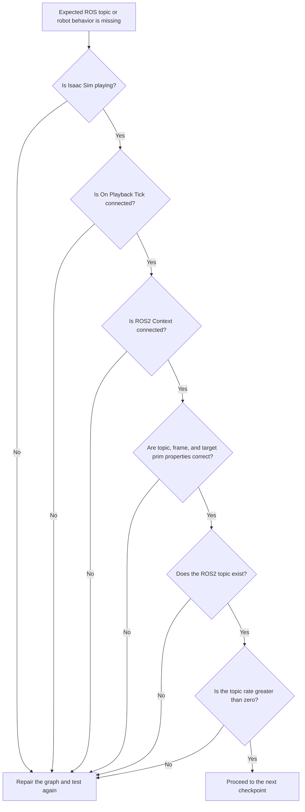

Use these commands:

```bash
ros2 topic list
ros2 topic type <topic_name>
ros2 topic echo <topic_name> --once
ros2 topic hz <topic_name>
ros2 topic info <topic_name> --verbose
```

For TF problems, use:

```bash
ros2 run tf2_tools view_frames
ros2 run tf2_ros tf2_echo odom base_footprint \
  --ros-args -p use_sim_time:=true
```

# Part G: Understand and Test ROS2 QoS

## Objective

Quality of Service controls how ROS2 publishers and subscribers exchange messages. In this section, you will inspect the QoS settings of the main topics used by the robot and explain why different data streams require different communication guarantees.

The official ROS2 documentation is available at:

[ROS2 Humble Quality of Service Settings](https://docs.ros.org/en/humble/Concepts/Intermediate/About-Quality-of-Service-Settings.html)

The important QoS properties are:

- Reliability
- Durability
- History
- Queue depth
- Liveliness
- Deadline

## G1. Inspect lidar QoS

Run:

```bash
ros2 topic info /scan --verbose
```

Record the following in your lab report:

```text
Reliability:
Durability:
History:
Depth:
Liveliness:
```

The sensor publisher should normally use a sensor-compatible profile.

## G2. Inspect camera QoS

Run:

```bash
ros2 topic info /camera/image_raw --verbose
```

Record the QoS values.

## G3. Inspect TF QoS

Run:

```bash
ros2 topic info /tf --verbose
```

Record the QoS values.

## G4. Inspect odometry QoS

Run:

```bash
ros2 topic info /odom --verbose
```

Record the QoS values.

## G5. Compare topic behavior

Run the following commands separately:

```bash
ros2 topic echo /scan --once
```

```bash
ros2 topic echo /camera/image_raw --once
```

```bash
ros2 topic echo /odom --once
```

Explain why these topics have different data types and potentially different QoS requirements.

## G6. QoS expectations

Use the following as conceptual guidance:

| Topic | Typical durability | Typical use |
|---|---|---|
| `/scan` | Volatile | Live sensor data |
| `/camera/image_raw` | Volatile | Live image stream |
| `/odom` | Volatile | Continuously changing state |
| `/tf` | Volatile | Continuously changing transforms |
| `/tf_static` | Transient Local | Static transforms |
| `/map` | Transient Local | Retained map |
| `/clock` | Volatile | Simulation time stream |

Do not change QoS settings during the first successful run.

If a subscriber cannot receive messages, inspect the publisher and subscriber QoS before changing code.

### Validation checkpoint G

Include the output of the following commands in the report:

```bash
ros2 topic info /scan --verbose
ros2 topic info /camera/image_raw --verbose
ros2 topic info /tf --verbose
ros2 topic info /odom --verbose
```

> Quick interpretation: QoS is not a cosmetic setting. It affects whether publishers and subscribers can exchange data reliably, especially for live sensor streams, TF data, and stored map information.

Save:

```text
~/RAS545/Lab3/work/Lab3_06_qos_verified.usda
```

---

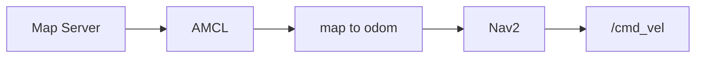

---

# Part H: Start Localization

## Objective

You will use a saved map and AMCL to estimate the robot pose.

The map files are:

```text
~/RAS545/Lab3/maps/turtlebot3_map.yaml
~/RAS545/Lab3/maps/turtlebot3_map.pgm
```

## H1. Verify the map files

Open a new terminal:

```bash
source /opt/ros/humble/setup.bash
export ROS_DOMAIN_ID=0
```

Run:

```bash
ls -l ~/RAS545/Lab3/maps/turtlebot3_map.yaml
ls -l ~/RAS545/Lab3/maps/turtlebot3_map.pgm
```

Display the YAML file:

```bash
sed -n '1,20p' ~/RAS545/Lab3/maps/turtlebot3_map.yaml
```

The image path must point to an existing file.

Verify the image path:

```bash
map_image=$(sed -n 's/^image:[[:space:]]*//p' \
  ~/RAS545/Lab3/maps/turtlebot3_map.yaml)

ls -l "$HOME/RAS545/Lab3/maps/$map_image"
```

The command must find:

```text
turtlebot3_map.pgm
```

## H2. Start localization

Keep Isaac Sim running and playing.

Run:

```bash
source /opt/ros/humble/setup.bash
export ROS_DOMAIN_ID=0

ros2 launch nav2_bringup localization_launch.py \
  map:=$HOME/RAS545/Lab3/maps/turtlebot3_map.yaml \
  use_sim_time:=true
```

Wait for output indicating:

```text
Managed nodes are active
```

The important nodes are:

```text
map_server
amcl
lifecycle_manager_localization
```

## H3. Check lifecycle states

In another terminal, run:

```bash
source /opt/ros/humble/setup.bash
export ROS_DOMAIN_ID=0

ros2 lifecycle get /map_server
```

Expected:

```text
active [3]
```

Run:

```bash
ros2 lifecycle get /amcl
```

Expected:

```text
active [3]
```

If the map server fails to configure, check:

1. The YAML path.
2. The image path inside the YAML.
3. File permissions.
4. Whether another `/map_server` is already running.
5. Whether the image file exists.

## H4. Verify `/map`

Run:

```bash
ros2 topic type /map
```

Expected:

```text
nav_msgs/msg/OccupancyGrid
```

Run:

```bash
ros2 topic echo /map --once
```

Expected map properties include:

```text
frame_id: map
resolution: 0.05
width: 177
height: 162
origin:
  position:
    x: -6.2
    y: -3.32
    z: 0.0
```

The map should use transient-local durability so that new subscribers can receive the stored map.

## H5. Open RViz2

<!--  -->

Start RViz2:

```bash
rviz2 --ros-args -p use_sim_time:=true
```

Set the RViz Fixed Frame:

```text
map
```

Add a Map display:

```text
Add → Map
```

Configure:

```text
Topic = /map
```

If the map is not visible, set:

```text
Durability Policy = Transient Local
```

Add a LaserScan display:

```text
Add → LaserScan
```

Set:

```text
Topic = /scan
```

Do not enter a separate laser-frame value in RViz2. RViz2 uses the frame contained in the LaserScan message.

Verify the message frame from a terminal:

```bash
ros2 topic echo /scan --once
```

The message must contain:

```text
header:
  frame_id: base_scan
```

If the frame is not `base_scan`, repair the `Frame ID` property of the `ROS2 RTX Lidar Helper` node.

Add:

```text
TF
```

Add:

```text
RobotModel
```

## H6. Set the initial pose

In RViz2, select:

```text
2D Pose Estimate
```

Click the approximate center of the robot on the map.

Drag the arrow in the direction that the robot is facing.

Release the mouse button.

The initial pose must be close enough that the lidar scan overlaps the map walls.

Wait five seconds.

AMCL should now publish:

```text
map → odom
```

## H7. Verify the complete transform

Run:

```bash
ros2 run tf2_ros tf2_echo map base_footprint \
  --ros-args -p use_sim_time:=true
```

Expected result:

```text
Translation: [...]
Rotation: [...]
```

The command must not repeatedly report:

```text
Could not find a connection between map and base_footprint
```

If the transform does not appear:

1. Confirm the initial pose was set in RViz.
2. Confirm AMCL is active.
3. Confirm `/scan` is publishing.
4. Confirm `odom → base_footprint` exists.
5. Confirm `map_server` is active.
6. Confirm `use_sim_time` is enabled.
7. Confirm Isaac Sim is playing.

### Validation checkpoint H

The following commands must succeed:

```bash
ros2 lifecycle get /map_server
ros2 lifecycle get /amcl
ros2 topic echo /map --once
ros2 run tf2_ros tf2_echo map base_footprint \
  --ros-args -p use_sim_time:=true
```

Save:

```text
~/RAS545/Lab3/work/Lab3_07_localization.usda
```

---

# Part I: Start Nav2 Navigation

## Objective

You will start the Nav2 planning and control system and send the robot to a goal using RViz2.

## I1. Start the navigation stack

Keep the following running:

- Isaac Sim
- ROS2 clock
- Drive Action Graph
- Lidar graph
- Camera graph
- Odometry and TF graph
- Localization launch
- RViz2

Open another terminal:

```bash
source /opt/ros/humble/setup.bash
export ROS_DOMAIN_ID=0

ros2 launch nav2_bringup navigation_launch.py \
  use_sim_time:=true
```

Wait until the terminal reports:

```text
Managed nodes are active
```

Important Nav2 nodes include:

```text
controller_server
planner_server
behavior_server
bt_navigator
waypoint_follower
velocity_smoother
lifecycle_manager_navigation
```

## I2. Verify lifecycle states

Run:

```bash
ros2 lifecycle get /controller_server
ros2 lifecycle get /planner_server
ros2 lifecycle get /bt_navigator
```

Each should report:

```text
active [3]
```

## I3. Verify costmap scan topic

The default Nav2 configuration expects the lidar topic:

```text
/scan
```

Verify that `/scan` is publishing:

```bash
ros2 topic hz /scan
```

Nav2 costmaps commonly report that they subscribe to:

```text
scan
```

This corresponds to the absolute ROS2 topic:

```text
/scan
```

Do not change the lidar topic to `/scan_fixed` unless the Nav2 parameters are also changed.

For this laboratory, use:

```text
/scan
```

## I4. Verify the global costmap

In RViz2, add:

```text
Map
```

Set:

```text
Topic = /map
```

Add:

```text
Global Costmap
```

If the display is available, configure its topic using the Nav2 costmap topic shown by RViz2.

The global costmap should show:

- Free space
- Occupied cells
- Inflated obstacle areas

## I5. Verify the local costmap

In RViz2, add:

```text
Local Costmap
```

The local costmap should move with the robot.

It should use the lidar data from:

```text
/scan
```

If the local costmap is empty:

1. Verify `/scan` is publishing.
2. Verify `header.frame_id` is `base_scan`.
3. Verify the complete TF chain exists.
4. Verify the RViz Fixed Frame is `map`.
5. Verify Isaac Sim is playing.

## I6. Send a navigation goal

<!--  -->

In RViz2, select:

```text
2D Goal Pose
```

Click a nearby free-space position on the map.

Drag the arrow to select the desired final orientation.

Release the mouse button.

Nav2 should:

1. Receive the goal.
2. Calculate a global path.
3. Calculate local velocity commands.
4. Publish commands on the configured velocity topic.
5. Move the robot.
6. Stop at the goal.

The robot should move at low speed.

If the robot moves unexpectedly, immediately send zero velocity:

```bash
ros2 topic pub --once /cmd_vel geometry_msgs/msg/Twist \
"{linear: {x: 0.0, y: 0.0, z: 0.0}, angular: {x: 0.0, y: 0.0, z: 0.0}}"
```

## I7. Verify goal completion

Observe the Nav2 terminal and RViz2.

The goal should change to a successful state.

Record:

- Initial robot position
- Goal position
- Final robot position
- Approximate navigation time
- Whether the robot stopped within the goal tolerance
- Whether the path avoided obstacles

### Validation checkpoint I

Demonstrate:

- A visible map in RViz2.
- A visible lidar scan.
- A visible robot TF tree.
- A planned path.
- Robot movement.
- Successful goal completion.

Save:

```text
~/RAS545/Lab3/work/Lab3_08_nav2_complete.usda
```

---

# Part J: Final Diagnostic Verification

Run the following commands and save their output in the lab results directory.

## J1. Node list

```bash
ros2 node list
```

## J2. Topic list

```bash
ros2 topic list
```

## J3. Topic types

```bash
ros2 topic type /clock
ros2 topic type /cmd_vel
ros2 topic type /odom
ros2 topic type /scan
ros2 topic type /camera/image_raw
ros2 topic type /map
```

Expected types:

```text
/clock              rosgraph_msgs/msg/Clock
/cmd_vel            geometry_msgs/msg/Twist
/odom               nav_msgs/msg/Odometry
/scan               sensor_msgs/msg/LaserScan
/camera/image_raw   sensor_msgs/msg/Image
/map                nav_msgs/msg/OccupancyGrid
```

## J4. Topic rates

```bash
ros2 topic hz /clock
ros2 topic hz /odom
ros2 topic hz /scan
ros2 topic hz /camera/image_raw
```

All active streams must show a nonzero rate.

## J5. TF graph

```bash
ros2 run tf2_tools view_frames
```

The graph must contain:

```text
map → odom → base_footprint
```

The graph must not contain:

```text
world → odom
```

## J6. Direct TF checks

```bash
ros2 run tf2_ros tf2_echo odom base_footprint \
  --ros-args -p use_sim_time:=true
```

```bash
ros2 run tf2_ros tf2_echo map base_footprint \
  --ros-args -p use_sim_time:=true
```

Both should return transform values after localization is initialized.

## J7. TF publishers

```bash
ros2 topic info /tf --verbose
```

There must not be two publishers assigning different parents to `odom`.

The following publisher must not exist:

```text
_Graph_ROS_Odometry_TFWorld2Odom
```

---

# Required Deliverables

This section summarizes the required artifacts for submission. Keep every checkpoint file and collect all relevant screenshots, command output, and validation evidence before the final check-off.

## 6.1 USD and USDA checkpoint files

Save the completed stage after each major checkpoint.

Submit the following files:

```text
Lab3_00_student_start.usda
Lab3_01_ros_clock.usda
Lab3_02_ros_drive.usda
Lab3_03_lidar.usda
Lab3_04_camera.usda
Lab3_05_odometry_tf.usda
Lab3_06_qos_verified.usda
Lab3_07_localization.usda
Lab3_08_nav2_complete.usda
```

Use the following directory:

```text
~/RAS545/Lab3/work/
```

Do not overwrite the original starter file.

If the instructor requires binary USD files, use:

```text
.usd
```

If the instructor requires text-based USD files, use:

```text
.usda
```

Confirm the intended meaning of `.uda` before submission because `.uda` is not a standard USD extension.

## 6.2 Lab report

Submit one formal lab report containing:

1. Title page
2. Lab objectives
3. Software and hardware configuration
4. Procedure
5. Results
6. Screenshots
7. ROS2 topic tables
8. TF tree
9. QoS analysis
10. Troubleshooting observations
11. Answers to assigned questions
12. Key learnings
13. Conclusion
14. References

Report template:

[RAS 545 Lab Report Template](https://docs.google.com/document/d/1HOYJqnCjeE1o-8Ghffh58nG2FxjORW-J/edit?usp=sharing&ouid=109541660202730576301&rtpof=true&sd=true)

Your report must include supporting images for:

- Starter USD scene
- TurtleBot hierarchy
- ROS clock graph
- Drive graph
- Lidar graph
- Camera graph
- Odometry and TF graph
- RViz map and lidar
- RViz initial pose
- RViz navigation goal
- Final robot position

## 6.3 Demonstration video

Record one or more videos showing:

1. Isaac Sim scene running.
2. TurtleBot moving from `/cmd_vel`.
3. Lidar data in RViz2.
4. Camera image data.
5. TF tree or transform verification.
6. Map and localization.
7. Nav2 goal execution.
8. Robot reaching the desired position.

Upload the video to an accessible location and submit the link.

The video must clearly show:

- The simulation is running.
- The robot is receiving commands.
- The robot moves under ROS2 control.
- The robot reaches the navigation goal.

## 6.4 Code and configuration

Submit:

- Any ROS2 launch commands or launch files.
- Any custom ROS2 Python scripts.
- Any custom configuration files.
- The map YAML file used.
- The ROS2 topic and diagnostic command logs.
- Any scripts used to validate the setup.

---

# Lab Check-Off

Notify the teaching staff immediately after:

1. The USD stage saves successfully.
2. All required ROS2 graphs are created.
3. The ROS2 workspace compiles successfully, if a workspace is required.
4. `/clock` is publishing.
5. `/cmd_vel` controls the robot.
6. `/scan` publishes a valid LaserScan.
7. `/camera/image_raw` publishes an image.
8. `/odom` publishes odometry.
9. The TF tree is connected.
10. AMCL publishes `map → odom`.
11. Nav2 reaches a goal.

The check-off demonstration must show a working system, not only screenshots or code.

---

# Troubleshooting Guide

Use this section as a quick-reference guide when the robot does not appear to be working. Start with the lowest-level check: whether Isaac Sim is playing, whether the graph is connected, and whether the topic exists in ROS2.

## 8.1 Isaac Sim opens but ROS topics do not appear

Check:

```bash
source /opt/ros/humble/setup.bash
export ROS_DOMAIN_ID=0
ros2 topic list
```

Then verify:

- Isaac Sim is playing.
- The ROS2 bridge extension is enabled.
- The ROS2 Context node exists.
- The graph has an `On Playback Tick` node.
- The graph is connected to the required publisher or subscriber.
- Isaac Sim was started after sourcing ROS2.

## 8.2 `/clock` does not exist

Check:

```text
ROS2 Publish Clock topicName = /clock
ROS2 Context domain ID = 0
On Playback Tick.tick → Publish Clock.execIn
Read Simulation Time.simulationTime → Publish Clock.timeStamp
Context.context → Publish Clock.context
```

Press Play.

Run:

```bash
ros2 topic echo /clock --once
```

## 8.3 The robot does not move

Check:

```bash
ros2 topic type /cmd_vel
```

Expected:

```text
geometry_msgs/msg/Twist
```

Check that the drive graph uses:

```text
Topic Name = /cmd_vel
```

Check:

```text
Target Prim = /turtlebot3_burger/base_footprint
Wheel Distance = 0.16
Wheel Radius = 0.025
Left Joint = wheel_left_joint
Right Joint = wheel_right_joint
```

Send a slow test command:

```bash
ros2 topic pub --rate 5 /cmd_vel geometry_msgs/msg/Twist \
"{linear: {x: 0.05, y: 0.0, z: 0.0}, angular: {x: 0.0, y: 0.0, z: 0.0}}"
```

## 8.4 The robot moves backward

Check:

- The sign of the linear X command.
- Wheel joint order.
- Wheel joint axis.
- Wheel joint orientations.

The correct joint order is:

```text
wheel_left_joint
wheel_right_joint
```

## 8.5 The robot spins instead of moving straight

Check:

- Left and right wheel joint names.
- Wheel distance.
- Wheel radius.
- Wheel joint orientations.
- Whether one wheel has an inverted axis.

## 8.6 `/scan` does not exist

Check:

```bash
ros2 topic list | grep scan
```

Check:

```text
Lidar sensor path = /turtlebot3_burger/base_scan/Lidar2D
Frame ID = base_scan
Topic Name = /scan
Type = laser_scan
Enabled = True
```

Verify the render product is connected to the lidar helper.

Verify Isaac Sim is playing.

## 8.7 `/scan` exists but contains no useful data

Check:

```bash
ros2 topic echo /scan --once
```

Verify:

```text
ranges
angle_min
angle_max
range_min
range_max
```

Check that the lidar:

- Is not inside the robot.
- Is not below the floor.
- Has translation `(0, 0, 0)` relative to `base_scan`.
- Has rotation `(0, 0, 0)` degrees relative to `base_scan`.
- Has a working render product.

## 8.8 The camera topic exists but no image is visible

Check:

```bash
ros2 topic hz /camera/image_raw
```

Verify:

```text
Camera Prim = /turtlebot3_burger/base_footprint/Camera_1
Type = rgb
Topic Name = /camera/image_raw
Enabled = True
```

Check the camera transform:

```text
X = 0.100 m
Y = 0.000 m
Z = 0.200 m
Rotation X = 90 degrees
Rotation Y = 0 degrees
Rotation Z = -90 degrees
```

Open:

```bash
ros2 run rqt_image_view rqt_image_view
```

Select:

```text
/camera/image_raw
```

## 8.9 `/odom` does not exist

Check:

```bash
ros2 topic list | grep odom
ros2 topic type /odom
```

Verify:

```text
Chassis Frame ID = base_footprint
Odom Frame ID = odom
Topic Name = /odom
```

Confirm:

```text
Isaac Compute Odometry.execOut
    → ROS2 Publish Odometry.execIn
```

Confirm simulation time is connected.

## 8.10 `odom → base_footprint` does not exist

Run:

```bash
ros2 run tf2_ros tf2_echo odom base_footprint \
  --ros-args -p use_sim_time:=true
```

Verify:

```text
Parent Frame ID = odom
Child Frame ID = base_footprint
```

Do not use:

```text
Parent Frame ID = world
Child Frame ID = odom
```

That transform conflicts with AMCL.

## 8.11 The TF tree contains `world → odom`

If the TF graph contains:

```text
world → odom
```

select the transform publisher that has:

```text
Parent Frame ID = world
Child Frame ID = odom
```

Delete or deactivate that publisher.

This laboratory must publish:

```text
odom → base_footprint
```

The laboratory does not require a `TFWorld2Odom` node. Do not create a world-to-odom transform.

Verify the result:

```bash
ros2 run tf2_tools view_frames
```

The graph must contain `odom → base_footprint` and must not contain `world → odom`.

## 8.12 `map → base_footprint` does not exist

Check the lower transform first:

```bash
ros2 run tf2_ros tf2_echo odom base_footprint \
  --ros-args -p use_sim_time:=true
```

If this fails, repair odometry and TF before checking AMCL.

If the lower transform works, check AMCL:

```bash
ros2 lifecycle get /amcl
```

Expected:

```text
active [3]
```

Set the initial pose in RViz2:

1. Set Fixed Frame to `map`.
2. Select `2D Pose Estimate`.
3. Click the robot’s position.
4. Drag the arrow to match the heading.
5. Wait five seconds.

Then run:

```bash
ros2 run tf2_ros tf2_echo map base_footprint \
  --ros-args -p use_sim_time:=true
```

## 8.13 The map server fails to configure

Check the file:

```bash
ls -l ~/RAS545/Lab3/maps/turtlebot3_map.yaml
```

Check the image:

```bash
ls -l ~/RAS545/Lab3/maps/turtlebot3_map.pgm
```

Check the YAML:

```bash
sed -n '1,20p' ~/RAS545/Lab3/maps/turtlebot3_map.yaml
```

The YAML must contain:

```yaml
image: turtlebot3_map.pgm
```

The image must be in the same directory as the YAML file.

## 8.14 The map appears in RViz2 but the lidar is misaligned

Check:

- Initial pose estimate.
- Lidar frame ID.
- `base_scan` transform.
- Camera and lidar sensor placement.
- Map origin.
- Robot orientation.
- Whether the robot is located in the correct map area.

The map origin is:

```text
X = -6.2 m
Y = -3.32 m
Z = 0.0 m
```

Do not change the map origin during this laboratory.

## 8.15 Nav2 costmap is empty

Check:

```bash
ros2 topic hz /scan
```

Check:

```bash
ros2 topic echo /scan --once
```

Check:

```bash
ros2 run tf2_ros tf2_echo map base_scan \
  --ros-args -p use_sim_time:=true
```

Verify that Nav2 uses:

```text
/scan
```

not:

```text
/scan_fixed
```

Check that the global costmap and local costmap are active.

## 8.16 Nav2 reports a transform timing error

A timing warning immediately after starting simulation can be transient.

Wait several seconds and verify that:

- Isaac Sim is playing.
- `/clock` is publishing.
- All ROS2 nodes use `use_sim_time:=true`.
- The sensor timestamps are simulation timestamps.
- The odometry and TF graphs use Isaac simulation time.

Restart only the affected ROS2 node if necessary.

## 8.17 ROS2 topics exist but the subscriber receives no data

Inspect the topic:

```bash
ros2 topic info /scan --verbose
```

Compare:

- Reliability
- Durability
- History
- Depth

QoS incompatibility can prevent communication even when the topic name is correct.

---

# Required Report Questions

Answer the following questions in complete sentences.

1. What is the function of the ROS2 Context node?
2. Why must Isaac Sim publish `/clock` when using `use_sim_time:=true`?
3. What is the difference between `/cmd_vel`, `/odom`, `/scan`, and `/tf`?
4. How does the Differential Controller convert robot velocity into wheel velocities?
5. Why are the wheel radius and wheel distance required?
6. Why does the lidar use the frame ID `base_scan`?
7. Why must the camera frame be included in the TF tree?
8. What is the difference between an RGB image and a CameraInfo message?
9. Why must AMCL publish `map → odom`?
10. Why must Isaac Sim publish `odom → base_footprint`?
11. Why is publishing both `world → odom` and `map → odom` problematic?
12. What is the purpose of transient-local durability for `/map`?
13. Why are live sensor topics normally not treated like a stored map?
14. What is the difference between a topic, service, and action in ROS2?
15. What is the purpose of the global costmap?
16. What is the purpose of the local costmap?
17. What diagnostic command would you use if `/scan` exists but Nav2 cannot use it?
18. What diagnostic command would you use if RViz2 cannot transform `map` to `base_footprint`?
19. What was the most important error encountered during this laboratory?
20. How did you identify and correct that error?

---

# Key Learning Summary

The system works because each component has a defined responsibility:

```text
Isaac Sim physics
    → simulates the robot

Drive Action Graph
    → converts /cmd_vel into wheel motion

Lidar Action Graph
    → publishes /scan

Camera Action Graph
    → publishes camera images

Odometry graph
    → publishes /odom and odom → base_footprint

TF graph
    → publishes robot link transforms

Map server
    → publishes /map

AMCL
    → publishes map → odom

Nav2
    → plans and controls motion to a goal
```

The complete navigation chain is:

```text
Goal in RViz2
    ↓
Nav2 planner
    ↓
Global path
    ↓
Nav2 controller
    ↓
Velocity command
    ↓
/cmd_vel
    ↓
Isaac Sim differential controller
    ↓
Wheel joints
    ↓
Robot motion
    ↓
Odometry
    ↓
TF
    ↓
AMCL localization
```

The most important final verification is:

```text
map → odom → base_footprint → base_scan
```

The system must not contain a competing:

```text
world → odom
```

---

# Additional Learning Resources

- [Isaac Sim 6.0.1: Driving TurtleBot Using ROS2 Messages](https://docs.isaacsim.omniverse.nvidia.com/6.0.1/ros2_tutorials/tutorial_ros2_drive_turtlebot.html)
- [Isaac Sim 6.0.1: ROS2 Clock](https://docs.isaacsim.omniverse.nvidia.com/6.0.1/ros2_tutorials/tutorial_ros2_clock.html)
- [Isaac Sim 6.0.1: ROS2 Cameras](https://docs.isaacsim.omniverse.nvidia.com/6.0.1/ros2_tutorials/tutorial_ros2_camera.html)
- [Isaac Sim 6.0.1: RTX Lidar Sensors](https://docs.isaacsim.omniverse.nvidia.com/6.0.1/ros2_tutorials/tutorial_ros2_rtx_lidar.html)
- [Isaac Sim 6.0.1: ROS2 Transform Trees and Odometry](https://docs.isaacsim.omniverse.nvidia.com/6.0.1/ros2_tutorials/tutorial_ros2_tf.html)
- [Isaac Sim 6.0.1: ROS2 Navigation](https://docs.isaacsim.omniverse.nvidia.com/6.0.1/ros2_tutorials/tutorial_ros2_navigation.html)
- [ROS2 Humble Quality of Service Settings](https://docs.ros.org/en/humble/Concepts/Intermediate/About-Quality-of-Service-Settings.html)
- [Nav2 Mapping and Localization](https://docs.nav2.org/rolling/configuration_and_development/first_time_robot_setup_guide/sensors/mapping_localization/)

---

# Final Completion Checklist

Before submitting, verify every item.

## Isaac Sim

- [ ] Starter USD opened successfully.
- [ ] Robot remains on the ground.
- [ ] Robot physics was not deleted.
- [ ] Robot articulation was not deleted.
- [ ] ROS2 clock graph exists.
- [ ] Drive graph exists.
- [ ] Lidar sensor exists.
- [ ] Lidar graph exists.
- [ ] Camera exists.
- [ ] Camera graph exists.
- [ ] Odometry graph exists.
- [ ] Every Action Graph has a visible `On Playback Tick` execution connection.
- [ ] Every ROS2 publisher has a connected ROS2 Context.
- [ ] Every timestamped publisher uses Isaac simulation time.
- [ ] Every sensor has the correct parent prim and frame ID.
- [ ] Every Action Graph has been photographed before moving to the next checkpoint.
- [ ] TF graph exists.
- [ ] `TFWorld2Odom` does not exist.
- [ ] Stage saves successfully.

## ROS2

- [ ] `/clock` publishes.
- [ ] `/cmd_vel` exists.
- [ ] `/odom` publishes.
- [ ] `/scan` publishes.
- [ ] `/camera/image_raw` publishes.
- [ ] `/camera/camera_info` publishes.
- [ ] `/map` publishes.
- [ ] `odom → base_footprint` exists.
- [ ] `map → odom` exists after AMCL initialization.
- [ ] The final TF tree is connected.
- [ ] The TF tree contains `map → odom → base_footprint`.
- [ ] The TF tree does not contain `world → odom`.
- [ ] No frame has two competing parents.

## Localization

- [ ] Map server is active.
- [ ] AMCL is active.
- [ ] Initial pose was set.
- [ ] Laser scan approximately overlaps the map.
- [ ] Robot pose changes when the robot moves.

## Navigation

- [ ] Planner server is active.
- [ ] Controller server is active.
- [ ] Global costmap is visible.
- [ ] Local costmap is visible.
- [ ] A path is generated.
- [ ] Robot reaches a goal.
- [ ] Robot stops at the goal.

## Submission

- [ ] All USD or USDA checkpoint files submitted.
- [ ] Lab report submitted.
- [ ] Screenshots included.
- [ ] Video link submitted.
- [ ] Code and configuration files submitted.
- [ ] Diagnostic outputs included.
- [ ] Teaching staff notified for check-off.
